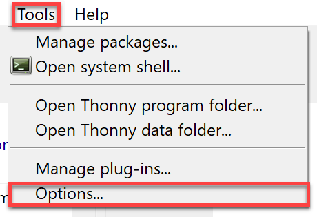
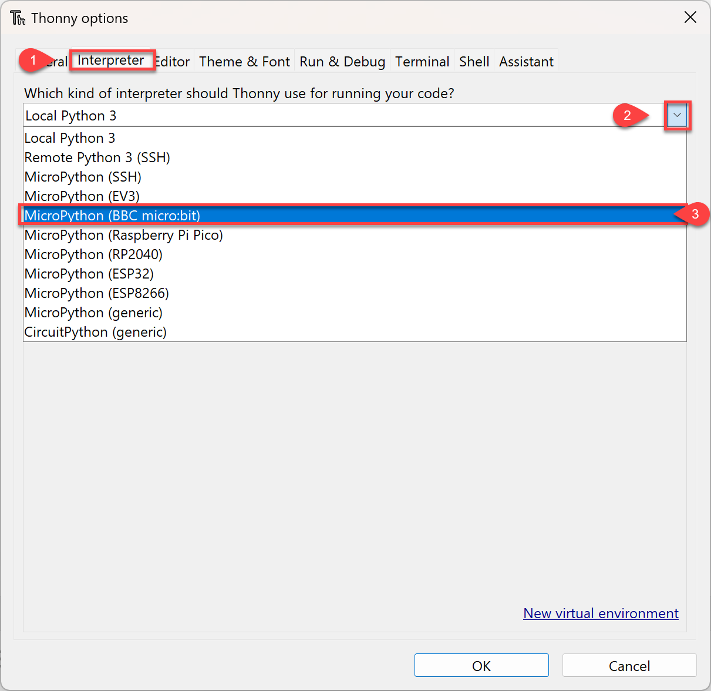
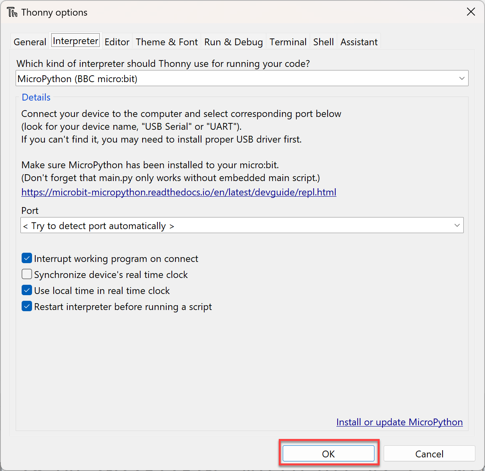
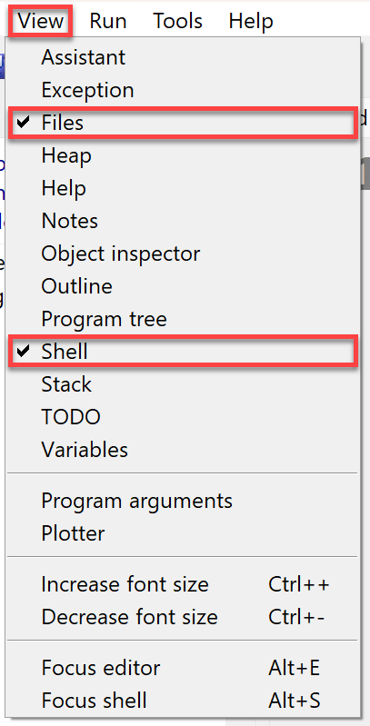
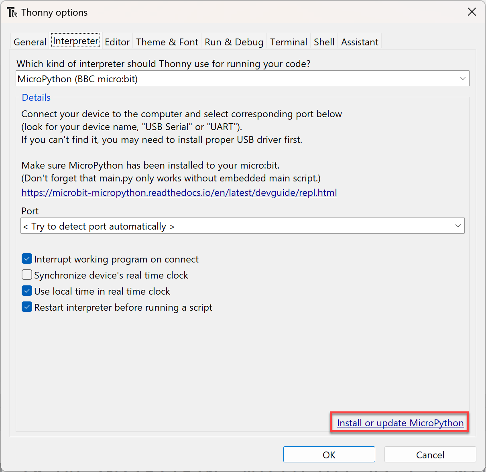
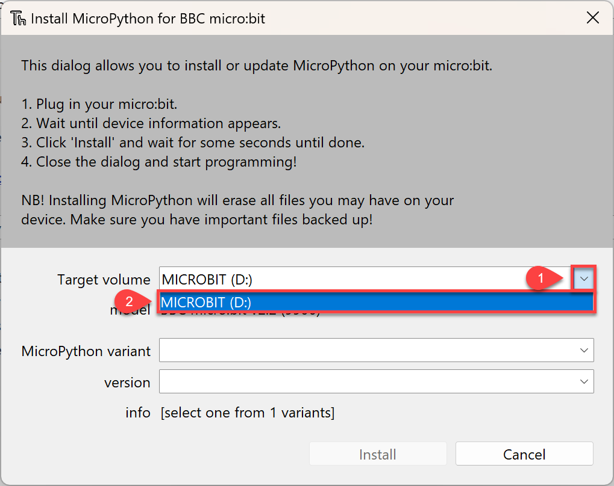
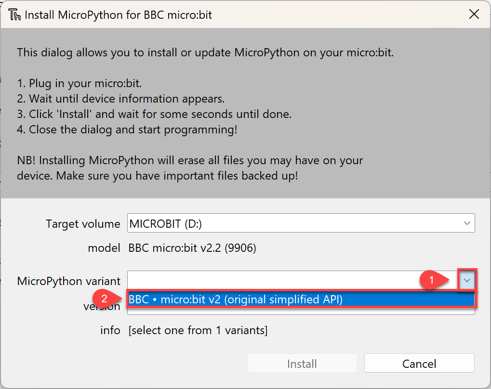
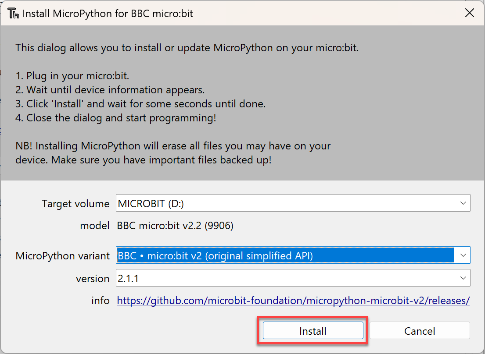
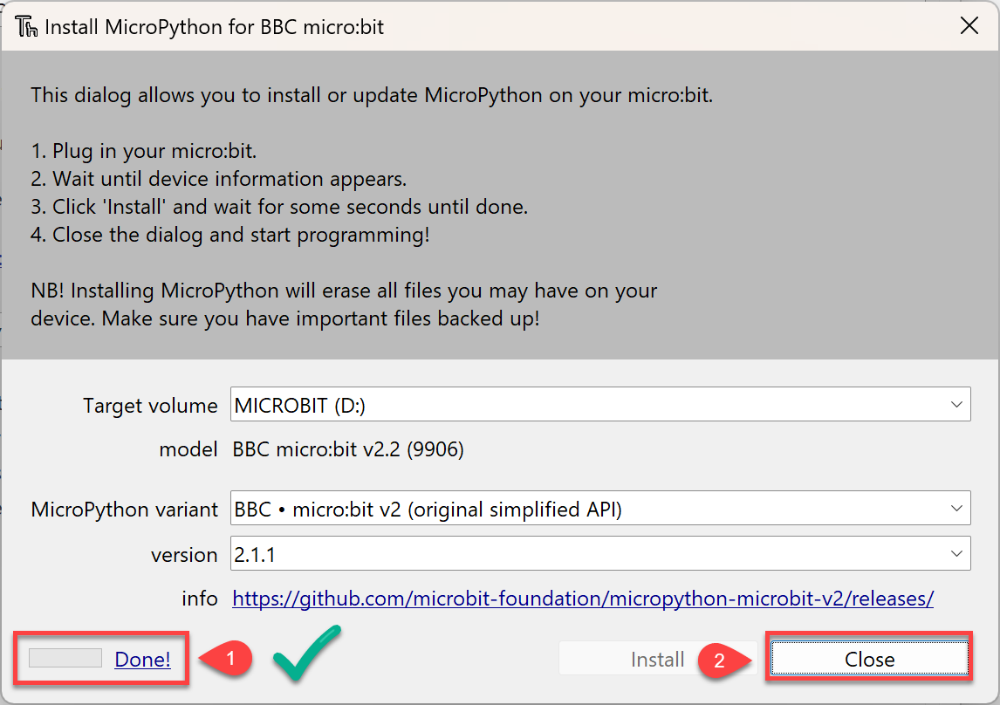
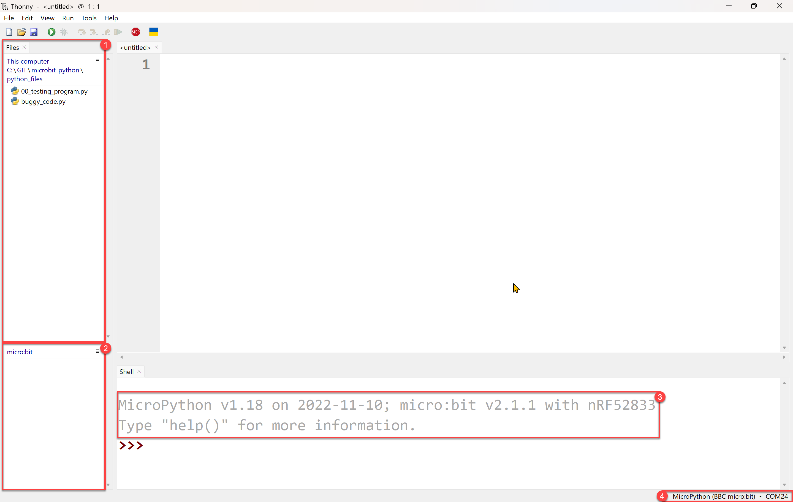

# Getting Started

During this course we will use **Thonny** to write **MicroPython** code for **micro:bits**. This section shows how to set everything up.

## What is MicroPython

MicroPython is a programming language based on Python. It is designed to run on small **microcontrollers**. Microcontrollers are tiny computer chips used in devices such as robots, sensors, and some household appliances. Writing programs for microcontrollers is called **embedded programming**.

## What is a micro:bit

We will use an educational microcontroller called a micro:bit. A micro:bit is a small, pocket-sized computer designed to help people learn coding and electronics. It has buttons, a display, and sensors that can be programmed to do different tasks.

## What is Thonny

For this course we will use the Thonny IDE. An IDE is an app for writing and running code. Thonny has built-in support for MicroPython and micro:bits. If you don't already have Thonny, download it from **[Thonny.org](https://thonny.org/)** and install it.

## Setup

### Prepare Thonny

The first setup step is to tell Thonny to use MicroPython on the micro:bit.

#### Connect micro:bit

Connect the micro:bit to your computer using the USB cable.

#### Change the Python Interpreter

By default, Thonny uses its own copy of Python 3 to run your Python scripts. For this course we want it to use MicroPython.

To change the interpreter:

Choose **Tools** &rarr; **Options**

Click **Interpreter**, then choose **MicroPython (BBC micro:bit)** from the dropdown.

Then click **OK**

#### Change Thonny panels

To work with files on the micro:bit, we need to show the **Files** panel in Thonny.

Click **View** and make sure **Files** is selected.

#### Installing MicroPython (optional)

You may need to update or install MicroPython on the micro:bit. Do this if your teacher asks you to, or if the micro:bit is not working properly with Thonny.

Go back to the **Interpreter** page.

Then click on **Install or update MicroPython**

Open the **Target volume** dropdown, then select **MICROBIT**. Your drive letter may be different.

Open the **MicroPython variant** dropdown, then select **BBC micro:bit v2 (original simplified API)**.

Then click **Install**

Wait until the progress says **Done** (1), then click **Close** (2)

## The IDE

Thonny is now set up. Your screen should look similar to the one below.

Some interesting points to note:

1. This is your computer files panel. It shows the files on your computer.
2. This is the micro:bit file panel. It shows the files that are on the micro:bit.
3. The prompt in the Shell should show:
   - MicroPython and its version
   - the micro:bit and its version
4. This shows that you are connected to a micro:bit and the port it is connected to.

