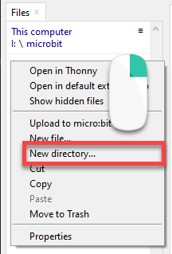
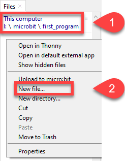
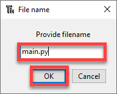
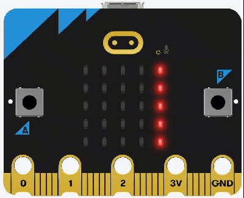
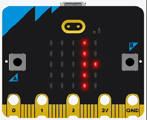
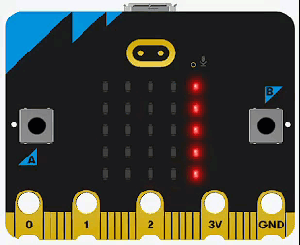
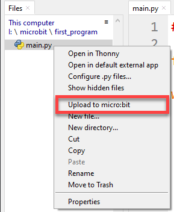
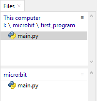

# Your First Program

Before we create our first program, we need to understand how MicroPython works.

## main.py

When a MicroPython microcontroller, like our micro:bit, is turned on, it looks for a file called `main.py` and runs that file. The project can have other files, but it must have a `main.py` file.

This means every project will have a `main.py` file. This causes a probelm because folders cannot have two files with the same name. If we put all our exercises in the same folder, we will not be able to have a `main.py` file for each exercise.

To solve this problem we will create a new folder for each exercise. Each folder will have its own `main.py` file. This is the reason we created the **microbit_tutorials** folder in the previous section. Inside that folder there is a folder for each exercise, and each exercise folder has its own `main.py` file.

## Creating additional programs (optional)

If you want to program in addition to our tutorial programs, you will need to create your own folders.

### Creating Folders

To create a new folder in Thonny right-click in the file panel and choose **New directory...**. A directory is the same thing as a folder.



```{admonition} Directories vs Folders
:class: note
In computing, directories and folders mean the same thing. They are containers for files and other directories.

The word "directory" was used in older text-based operating systems. The word "folder" became common when computers started using graphical interfaces with folder icons.
```

### Create the New File

Now we will create a new file. First, check that you are in the correct folder (1). Then right-click and choose **New file...** (2).



Name the file **main.py** and click **OK**.



## Running your first program

1. Navigate to the **01_first_program** folder in Thonny. 
2. You should see a file called **main.py**. Double-click it to open it. You should see the code below:

```{literalinclude} ./python_files/01_first_program/main.py
:linenos:
```

We are going to run our program for the first time. Before we do, let's introduce the PRIMM process.

```{admonition} PRIMM
:class: note
Throughout this course, we will use the **PRIMM** process to help us learn. **PRIMM** stands for **Predict**, **Run**, **Investigate**, **Modify**, and **Make**.

**Predict**: Before you run the code, write down what you think will happen.

**Run**: Run the program and check your prediction. If your prediction was not correct, how was the result different?

**Investigate**: Go through the code and work out what each line does.

**Modify**: Edit the code. Change it and see what results you get.

**Make**: Use what you have learned to make your own program.
```

Let's run through the **PRIMM** process now.

**Predict** what you think the program will do. Be specific. Then **run** the program.



Did you predict that `"Hello world!"` would scroll across the display before showing a heart for one second?

```{admonition} Code explanation
:class: notice
- **line 1** &rarr; imports all the commands from the `microbit` library.
- **line 9** &rarr; sets up the endless loop.
- **line 15** &rarr; scrolls the text across the display.
- **line 16** &rarr; shows the heart image.
- **line 17** &rarr; waits 1000 milliseconds before going back to the top of the loop.
```

For more details, check the **[display.scroll docs](https://microbit-micropython.readthedocs.io/en/latest/display.html#microbit.display.scroll)**.

## First Program Exercises

Time to **modify** the code and see what happens:

### Exercise 1

1. Navigate to the **01_first_program_ex1** folder in Thonny and open the **main.py** file.
2. Adjust the code to make it display a different message? For example:



### Exercise 2

1. Stop **main.py** then navigate to the **01_first_program_ex2** folder in Thonny and open the **main.py** file.
2. Adjust so that is displays other shapes. For example:



### Exercise 3

What happens if you remove the `while` statement? Why?

### Exercise 4

What happens if you unplug the micro:bit and plug it back in again? Why?

## Upload the code

When you unplugged the micro:bit and plugged it back in, the program did not restart. This is a problem because microcontrollers are often meant to run by themselves, without being connected to a computer.

If you look at Thonny's file panel, you will see the problem: your code is on your laptop, not on the micro:bit.

To solve this, we need to upload the code to the micro:bit.

Right-click `main.py` on your computer and choose **Upload to micro:bit**.



You should now have `main.py` on both your laptop and the micro:bit.



```{admonition} Duplicate files
:class: warning
You now have two copies of `main.py`. These files **do not sync**. If you make changes to one file, the other file will not update automatically.

The best way to keep files updated is to build a good working habit.

Use this habit:

- always edit the laptop copy of the file &rarr; this is your main copy
- then upload the file to the micro:bit
```

Now try unplugging your micro:bit and plugging it back in. The program works, but the micro:bit is still connected to your computer. That is because it needs power from your laptop.

Let's make your micro:bit run without the laptop.

Get the battery back out of your kit. Unplug the micro:bit and plug the battery pack in (make sure the battery pack is turned on).

The micro:bit can now run without the laptop.
