# Micro:bit Display

<iframe width="560" height="315" src="https://www.youtube-nocookie.com/embed/eRhlaXqT-0w" title="YouTube video player" frameborder="0" allow="accelerometer; autoplay; clipboard-write; encrypted-media; gyroscope; picture-in-picture; web-share" allowfullscreen></iframe>

We have already used the micro:bit display in our first program. In this section, we will learn more about its features.

```{admonition} Documentation
:class: important
Throughout this tutorial, links to the official documentation will be provided in green callout boxes like this one.

All the display functions can be found at the **[BBC micro:bit MicroPython display documentation](https://microbit-micropython.readthedocs.io/en/latest/display.html#module-microbit.display)**.
```

## Text

### Scroll

```{admonition} scroll function
:class: important
**`microbit.display.scroll(text, delay=150, \*, wait=True, loop=False, monospace=False)`**

Full details can be found at the **[BBC micro:bit MicroPython display.scroll documentation](https://microbit-micropython.readthedocs.io/en/latest/display.html#microbit.display.scroll)**.
```

Our first program used the `scroll()` function to make a string scroll across the display.

```{literalinclude} ./python_files/01_first_program/main.py
:linenos:
```


Although our example uses strings, the `scroll()` function can also display **floats**, **integers**, and **Boolean** values.

### Show

```{admonition} show function
:class: important
**`microbit.display.show(image)`**

Full details can be found at the **[BBC micro:bit MicroPython display.show documentation](https://microbit-micropython.readthedocs.io/en/latest/display.html#microbit.display.show)**.
```

Another way to display characters is to use the `show()` function.

Before we can run the code below, we need to:

1. stop the micro:bit by clicking Thonny's **stop** button
2. close **main.py**
3. navigate back to the **micro:bit** directory and open the **02_display_show** folder
4. double-click the **main.py** file to open it in Thonny

Create a new file called **main.py** and add the code below.

```{literalinclude} ./python_files/02_display_show/main.py
:linenos:
```

1. **Predict** what you think the program will do. Be specific. For example, "pause for 2 seconds" is better than just "pause". 
2. Then **run** the program.

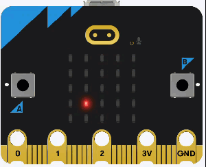

```{admonition} Code explanation
:class: notice
- **line 1** &rarr; imports all the commands from the `microbit` library.
- **line 9** &rarr; sets up the endless loop.
- **line 15** &rarr; `display.show()` displays one character at a time.
  - `3.14159` &rarr; message to be displayed. This can be a string, integer, float or Boolean.
  - `delay=500` &rarr; puts a 500 millisecond pause after each character
- **line 16** &rarr; `display.clear()` changes the value of each pixel to `0`, which clears the screen.
- **line 17** &rarr; waits 1000 milliseconds before going back to the top of the loop.
```

Time to **modify** the code and see what happens:

### Show Exercise 1

1. Open the **main.py** file in the **02_display_show_ex1** folder in Thonny.
2. Can you make it display a different message? For example:

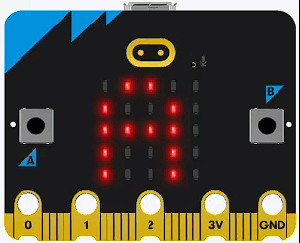

### Show Exercise 2

1. Stop and close the current **main.py** file. 
2. Open the **main.py** file in the **02_display_show_ex2** folder in Thonny. 
3. Can you change the time between each character? For example:

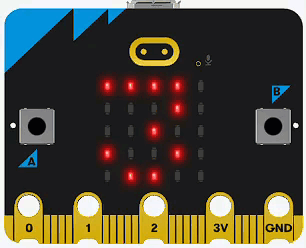

### Show Exercise 3

1. Stop and close the current **main.py** file.
2. Open the **main.py** file in the **02_display_show_ex3** folder in Thonny. 
3. Using the details in the **display.show docs**, can you display the same message without the `while True` loop?

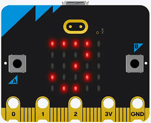

## Images

```{admonition} micro:bit Images
:class: important
The micro:bit has a wide range of **[pre-set images](https://microbit-micropython.readthedocs.io/en/latest/image.html#attributes)** that can be used with the `show()` function.
```

You can also use the `display.show()` function to display pre-set images.

1. Stop and close the **main.py** file in the **02_display_show** folder.
2. Navigate to the **03_display_images** folder in Thonny.
3. Double-click the **main.py** file to open it in Thonny.

You should see the code below:

```{literalinclude} ./python_files/03_display_images/main.py
:linenos:
```

1. **Predict** what you think the program will do. Remember to be specific. Then
2. **Run** the program.

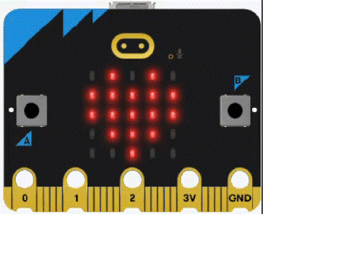

```{admonition} Code explanation
:class: notice
- **line 15** &rarr; `display.show(Image.HEART)` shows a heart on the display.
- **line 17** &rarr; `display.show(Image.HEART_SMALL)` shows a small heart on the display.
```

Time to **modify** the code:

### Image Exercise 1

1. Stop and close the current **main.py** file.
2. Open the **main.py** file in the **03_display_images_ex1** folder in Thonny.
3. Change the heartbeat animation so it looks more like an **[actual heartbeat](https://www.youtube.com/watch?v=gJpT_wHZeF8)**? Like this:

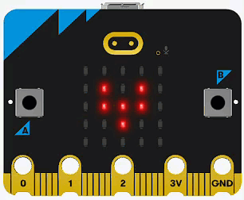
  
### Image Exercise 2
  
1. Stop and close the current **main.py** file.
2. Open the **main.py** file in the **03_display_images_ex2** folder in Thonny.
3. Use the **[pre-set images](https://microbit-micropython.readthedocs.io/en/latest/image.html#attributes)** to make the display show a clock face progressing from 1 to 12? Like this:

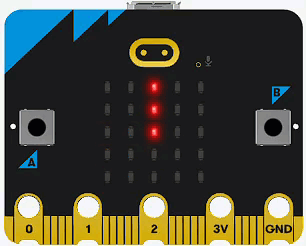

### Image Exercise 3

1. Stop and close the current **main.py** file.
2. Open the **main.py** file in the **03_display_images_ex3** folder in Thonny.
3. Use the **[pre-set images](https://microbit-micropython.readthedocs.io/en/latest/image.html#attributes)** to make the display show a square spinning? Like this:

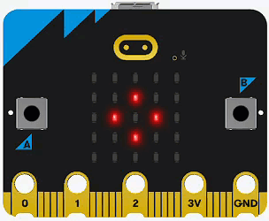

## Custom

```{admonition} set_pixel function
:class: important

**`microbit.display.set_pixel(x, y, value)`**

Full details can be found at the **[BBC micro:bit MicroPython display.set_pixel documentation](https://microbit-micropython.readthedocs.io/en/latest/display.html#microbit.display.set_pixel)**.
```

You can also directly control the individual LEDs on the display. The image below shows the coordinate numbers for each LED:

- top left &rarr; `(0,0)`
- bottom right &rarr; `(4,4)`

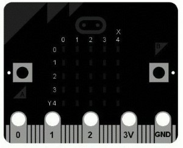

Each pixel can be set to a value from `0` (off) to `9` (brightest).

1. Stop and close the **main.py** file in the **03_display_images** folder.
2. Navigate to the **04_display_custom** folder in Thonny.
3. Double-click the **main.py** file to open it in Thonny.

You should see the code below:

```{literalinclude} ./python_files/04_display_custom/main.py
:linenos:
```

1. **Predict** what you think the program will do. Remember to be specific.
2. **Run** the program.

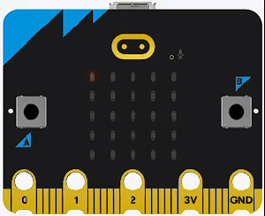

```{admonition} Code explanation
:class: notice 
This code uses nested loops. A nested loop is a loop inside another loop.

- **line 7** &rarr; stores the number of rows on the display.
- **line 8** &rarr; stores the number of columns on the display.
- **line 10** &rarr; clears the display before the loop starts.
- **line 11** &rarr; creates an endless loop.
- **line 17** &rarr; changes the column number from `0` to `4`.
- **line 18** &rarr; changes the row number from `0` to `4` for each column.
- **line 19** &rarr; turns the selected LED on at full brightness.
- **line 20** &rarr; waits 50 milliseconds so the LED can be seen.
- **line 21** &rarr; clears the display before moving to the next LED.
```

Time to **modify** the code:

### Custom Exercise 1

1. Stop and close the current **main.py** file.
2. Open the **main.py** file in the **04_display_custom_ex1** folder in Thonny.
3. What happens if you remove the `sleep(50)` statement? Why do you think this happens?

### Custom Exercise 2

1. Stop and close the current **main.py** file.
2. Open the **main.py** file in the **04_display_custom_ex2** folder in Thonny.
3. Can you change the code so it moves across the rows instead of down the columns? 


### Custom Exercise 3

1. Stop and close the current **main.py** file.
2. Open the **main.py** file in the **04_display_custom_ex3** folder in Thonny.
3. 4. Can you create this smiley face with glasses? The **[Image class](https://microbit-micropython.readthedocs.io/en/latest/image.html#microbit.Image)** might help.

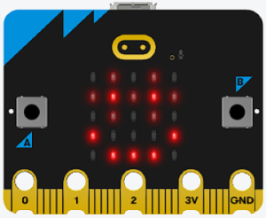

## Other Functions

There are other display-related functions, such as:

- **[get_pixel](https://microbit-micropython.readthedocs.io/en/latest/display.html#microbit.display.get_pixel)** &rarr; returns the brightness of a given pixel
- **[on](https://microbit-micropython.readthedocs.io/en/latest/display.html#microbit.display.on)** &rarr; turns the display on
- **[off](https://microbit-micropython.readthedocs.io/en/latest/display.html#microbit.display.off)** &rarr; turns the display off
- **[is_on](https://microbit-micropython.readthedocs.io/en/latest/display.html#microbit.display.is_on)** &rarr; indicates if the display is on
- **[read_light_level](https://microbit-micropython.readthedocs.io/en/latest/display.html#microbit.display.read_light_level)** &rarr; gives a reading of the light level around the micro:bit.

