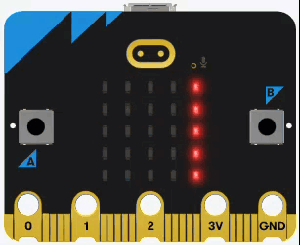
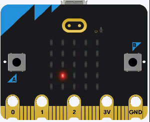
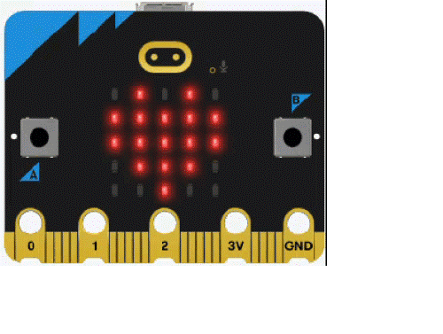
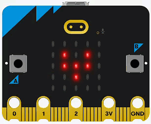
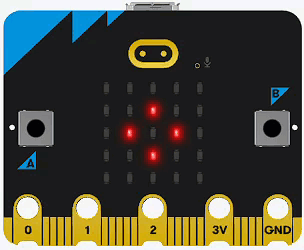
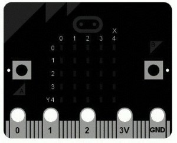
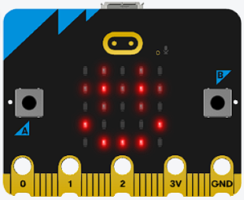

# Micro:bit Display

We have already used the micro:bit display in our first program. In this section we will learn more of it's features.

```{admonition} Documentation
:class: important
Througout this tutorial, links to the official documentation will be provided in this green callouts.

All the display functions can be found at the **[BBC micro:bit MicroPython display documentation](https://microbit-micropython.readthedocs.io/en/latest/display.html#module-microbit.display)**.
```

## Text

### Scroll

```{admonition} scroll function
:class: important
Full details can be found at the **[BBC micro:bit MicroPython display.scroll documentation](https://microbit-micropython.readthedocs.io/en/latest/display.html#microbit.display.scroll)**.
```

Our first program used the `scroll()` function to make a string scroll across the display.

```{literalinclude} ./python_files/first_program/main.py
:linenos:
```



Although our example uses strings, the `scroll()` function can also display **floats**, **integers** and **Boolean** values.

### Show

```{admonition} show function
:class: important
Full details can be found at the **[BBC micro:bit MicroPython display.show documentation](https://microbit-micropython.readthedocs.io/en/latest/display.html#microbit.display.show)**.
```

The other option to display characters is the `show()` function.

Before we can run the code below, we need to:

- stop the micro:bit by clicking on Thonny's **stop** button
- navigate back to the **micro:bit** directory and create a new directory called **display_show**.
- navigate to the **display_show** directory.

Create a new file called **main.py** and add the code below.

```{literalinclude} ./python_files/display_show/main.py
:linenos:
```

**Predict** in detail what you think the program will do. Make sure you are specific in your prediction ("pause for 2 seconds" is better than just "pause"), then **run** the program.



Let's **investigate** that code by breaking it down.

- line 1 &rarr; comment identifying the project.
- line 3 &rarr; imports all the commands from the `micropython` library.
- line 5 &rarr; sets up the endless loop.
- line 6 &rarr; `display.show()` displays one character at a time. 
  - `3.14159` &rarr; message to be displayed. This can be a string, integer, float or Boolean.
  - `delay=500` &rarr; puts a 500 millisecond pause after each character
- line 7 &rarr; `display.clear()` changes the value of each pixel to `0` effectively clearing the screen.
- line 8 &rarr; waits 1000 milliseconds before going back to the top of the loop.

Time to **modify** the code and see what happens:

### Text Exercises

1. Can you make it display a different message? For example:


2. Can you change the time between each character? For example:


3. using the details in the **display.show docs** can you make display the same message without the `while True` loop?


## Images

```{admonition} micro:bit Images
:class: important
The micro:bit has a wide range of **[pre-set images](https://microbit-micropython.readthedocs.io/en/latest/image.html#attributes)** that can be used with the show method.
```

You can also use the `display.show` function to display present images.

Again, since we are making a new program, we need to create a new folder called **display_images** in the **micro:bit folder**. Then create a new **main.py** file.

Then add the following code to the file.

```{literalinclude} ./python_files/display_images/main.py
:linenos:
```

**Predict** in detail what you think the program will do, remember specific, then **run** the program.



Let's **investigate** by impacting the new code:

- line 6 &rarr; `display.show(Image.HEART)` shows a heart on the display
- line 8 &rarr; `display.show(Image.HEART_SMALL)` shows a small heart on the display

Time to **modify** the code:

### Image Exercises

1. Can you change the heartbeat animation to reflect an **[actual heartbeat](https://www.youtube.com/watch?v=gJpT_wHZeF8)**? Like this?



2. Can you make the display show a clock face progressing from 1 to 12? Like this:


3. Can you make the display show a square spinning? Like this:



## Custom

```{admonition} set_pixel function
:class: important
Full details can be found at the **[BBC micro:bit MicroPython display.set_pixel documentation](https://microbit-micropython.readthedocs.io/en/latest/display.html#microbit.display.set_pixel)**.
```

You can also directly control the individual LEDs on the display. The image below shows the coordinate numbers for each of the LEDs:

- top left &rarr; `(0.0)`
- bottom right &rarr; `(4,4)`



Each pixel can be set to a value from `0` (off) to `9` (brightest)

To explore this we will make a new program. Create a new folder called **display_custom** in the **micro:bit folder**. Then create a new **main.py** file.

Add the code below, save t an then run in on the micro:bit.

```{literalinclude} ./python_files/display_custom/main.py
:linenos:
```

**Predict** in detail what you think the program will do, remember specific, then **run** the program.


Ok, this code is a bit more complicated, so lets investigate.

- first the structure:
  - two `for` loops nested inside a `for` loop which is also nested inside a `for` loop, which is nested inside the infinite `while` loop.
  - the coordinate loops:
    - line 8 `for` loop &rarr; increments the `x` value from `0` to `4`
    - line 9 `for` loop &rarr; increments the `y` value from `0` to `4` for each increment of the `x` value
    - the coordinates produced by these two loops will proceed:
      - for the `x` value of `0` &rarr; `y` values `0` to `4`
      - for the `x` value of `1` &rarr; `y` values `0` to `4`
      - for the `x` value of `2` &rarr; `y` values `0` to `4`
      - for the `x` value of `3` &rarr; `y` values `0` to `4`
      - for the `x` value of `4` &rarr; `y` values `0` to `4`
  - the display loops:
    - line 10 `for` loop &rarr; increase the LED value from `0` to `9` (off to brightest)
    - line 13 `for` loop &rarr; decrease the LED value from `9` to `0` (brightest to off)
      - the second `-1` in range(9,-1,-1) &rarr; reverse order

Time to **modify** the code:

### Custom Exercises

1. What happens if you remove both of the `sleep(10)` statements? Why do you think this happens?

2. Can you change the code so it moves across the rows rather than down the columns? 


3. Can you create this smiley face with glasses? The **[Image class](https://microbit-micropython.readthedocs.io/en/latest/image.html#microbit.Image)** might help



## Other Functions

There are other display related functions such as:

- **[get_pixel](https://microbit-micropython.readthedocs.io/en/latest/display.html#microbit.display.get_pixel)** &rarr; returns the brightness of a given pixel
- **[on](https://microbit-micropython.readthedocs.io/en/latest/display.html#microbit.display.on)** &rarr; turns the display on
- **[off](https://microbit-micropython.readthedocs.io/en/latest/display.html#microbit.display.off)** &rarr; turns the display off
- **[is_on](https://microbit-micropython.readthedocs.io/en/latest/display.html#microbit.display.is_on)** &rarr; indicates if the display is on
- **[read_light_level](https://microbit-micropython.readthedocs.io/en/latest/display.html#microbit.display.read_light_level)** &rarr; gives a reading of the ambient light.

