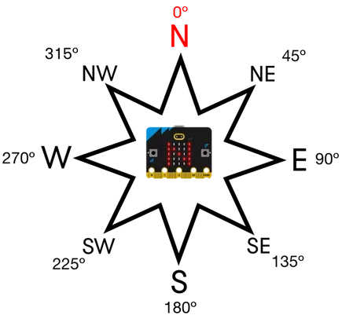

# Micro:bit Compass Sensor

<iframe width="560" height="315" src="https://www.youtube-nocookie.com/embed/a3P6LWwPBqM" title="YouTube video player" frameborder="0" allow="accelerometer; autoplay; clipboard-write; encrypted-media; gyroscope; picture-in-picture; web-share" allowfullscreen></iframe>

Your micro:bit has an input sensor that measures magnetic fields. This sensor is called a **magnetometer**, and it lets the micro:bit work like a compass.

```{admonition} Compass functions
:class: important
Full details can be found at the **[BBC micro:bit MicroPython compass documentation](https://microbit-micropython.readthedocs.io/en/latest/compass.html#module-microbit.compass)**.
```

## Calibrate

Before you use the compass, it needs to be calibrated. Calibration helps the micro:bit work out how it is facing compared to the Earth's magnetic field. To calibrate it, tilt the micro:bit in different directions until all the LEDs are lit.

Calibration will start automatically if the compass is used and no calibration data has been saved. You can also start calibration yourself by calling `compass.calibrate()`.

## Heading

The micro:bit uses `heading()` to return its current compass bearing from `0` to `359` degrees. The reading is taken from the top of the micro:bit, where the USB socket is.

The image below shows how the numbers match the compass directions: North, South, East, West, North-East, South-East, North-West, and South-West. For example, if the top of the micro:bit is pointing South-East (SE), the micro:bit will give a reading of `135`.



1. Stop and close the current **main.py** file.
2. Navigate to the **12_heading** folder in Thonny and open the **main.py** file.

You should see the code below:

```{literalinclude} ./python_files/12_heading/main.py
:linenos:
```

1. **Predict** what you think will happen. Be specific.
2. **Run** the program.
3. Time to **investigate** the code. What does each line do?

```{admonition} Code explanation
:class: notice
- **line 9** &rarr; creates an endless loop.
- **line 11** &rarr; gets the current compass heading and stores it in the `heading` variable.
- **line 16** &rarr; scrolls the current compass heading across the display.
- **line 18** &rarr; waits 500 milliseconds before going back to the top of the loop.
```

### Heading Exercise 1

1. Stop and close the current **main.py** file.
2. Open the **main.py** file in the **12_heading_ex1** folder in Thonny.
3. Make a program that displays `N` when the micro:bit is pointing North.

### Heading Exercise 2

1. Stop and close the current **main.py** file.
2. Open the **main.py** file in the **12_heading_ex2** folder in Thonny.
3. Improve the last program so it shows the 8 compass directions from the image above when button **A** is pressed.

## Magnetic Strength

The magnetometer measures magnetic fields. When it measures the Earth's magnetic field, the micro:bit can work like a compass. We can also use it to measure nearby magnetic fields.

The `get_field_strength()` method returns the strength of the magnetic field around the micro:bit in nanoteslas.

1. Stop and close the current **main.py** file.
2. Navigate to the **13_mag_strength** folder in Thonny and open the **main.py** file.

You should see the code below:

```{literalinclude} ./python_files/13_mag_strength/main.py
:linenos:
```

1. **Predict** what you think will happen. Be specific.
2. **Run** the program.
3. Time to **investigate** the code. What does each line do?

```{admonition} Code explanation
:class: notice
- **line 9** &rarr; creates an endless loop.
- **line 11** &rarr; gets the current magnetic field strength and stores it in the `field` variable.
- **line 16** &rarr; scrolls the value of `field` across the display.
- **line 18** &rarr; waits 500 milliseconds before going back to the top of the loop.
```

### Magnetic Strength Exercise 1

1. Stop and close the current **main.py** file.
2. Open the **main.py** file in the **13_mag_strength_ex1** folder
3. Change the code so it displays microteslas with no decimal places.

### Magnetic Strength Exercise 2

1. Stop and close the current **main.py** file.
2. Open the **main.py** file in the **13_mag_strength_ex2** folder
3. Make a program that shows a smiley face if the magnet is touching the right side of the micro:bit. Otherwise, it should show an angry face.
