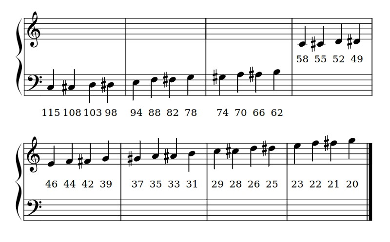
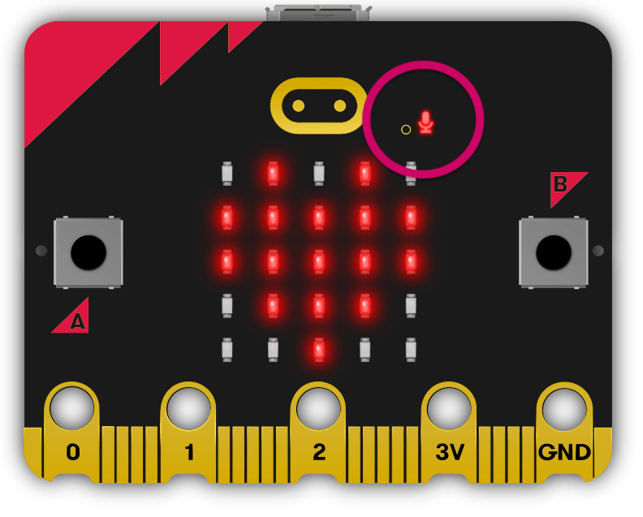

# Micro:bit Sound

<iframe width="560" height="315" src="https://www.youtube-nocookie.com/embed/r53PjFwyAhw" title="YouTube video player" frameborder="0" allow="accelerometer; autoplay; clipboard-write; encrypted-media; gyroscope; picture-in-picture; web-share" allowfullscreen></iframe>

MicroPython on the BBC micro:bit comes with a powerful music and sound module, which can drive the micro:bit 2 speaker.

```{admonition} Documentation
:class: important
All the sound functions can be found across the **[BBC micro:bit MicroPython music documentation](https://microbit-micropython.readthedocs.io/en/v2-docs/music.html)**, **[BBC micro:bit MicroPython speech documentation](https://microbit-micropython.readthedocs.io/en/v2-docs/speech.html)**, and **[BBC micro:bit MicroPython speech documentation](https://microbit-micropython.readthedocs.io/en/v2-docs/microphone.html)**.
```

## Music

```{admonition} Music
:class: important
Full details can be found at the **[BBC micro:bit MicroPython Music documentation](https://microbit-micropython.readthedocs.io/en/latest/music.html#module-music)**.
```

MicroPython on the BBC micro:bit comes with a powerful music and sound module. It’s very easy to generate bleeps and bloops from the device using the speaker.

### Built-in tunes

Notice that we import the music module. It contains methods used to make and control sound. For example:

```{literalinclude} ./python_files/sound_music_example/main.py
:linenos:
```

```{admonition} Code explaination
:class: notice
- **line 3** &rarr; import the music module
- **line 5** &rarr; play the built in melody NYAN
```

MicroPython has quite a lot of built-in melodies: **[here is the complete list](https://microbit-micropython.readthedocs.io/en/latest/music.html#built-in-melodies)**.

### Custom Tunes

Creating your own tunes is easy!

Each **note** has a name (like C# or F), an **octave** (telling MicroPython how high or low the note should be played) and a **duration** (how long it lasts through time). 

**Octaves** are indicated by a number ~ 0 is the lowest octave, 4 contains middle C and 8 is about as high as you’ll ever need unless you’re making music for dogs. 

**Durations** are also expressed as numbers. The higher the value of the duration the longer it will last. Such values are related to each other - for instance, a duration of 4 will last twice as long as a duration 2 (and so on). 

If you use the note name **R** then MicroPython will play a rest (i.e. silence) for the specified duration.

- Use **#** to designate a sharp note
- Use **b** to designate a flat note

Each note is expressed as a string of characters like this:

```
NOTE[octave][:duration]
```

For example, `"A1:4"`` refers to the note named `A` in octave number `1` to be played for a duration of `4`.

Make a list of notes to create a melody (it’s equivalent to creating an animation with a list of images). For example, here’s how to make MicroPython play opening of “Frere Jaques”:

```{literalinclude} ./python_files/sound_music_example_2/main.py
:linenos:
```

```{admonition} Code explaination
:class: notice
- **line 3** &rarr; import the music module
- **line 5** &rarr; store the notes of "Frere Jaques" in a list called tunes
- **line 7** &rarr; play the notes stored in tunes
```

### Sound Effects

MicroPython lets you make tones that are not musical notes. For example, here’s how to create a Police siren effect:

```{literalinclude} ./python_files/sound_effects_example/main.py
:linenos:
```

Notice how the `music.pitch` method is used in this instance. It expects a frequency. For example, the frequency of `440` is the same as a concert A used to tune a symphony orchestra.

```{admonition} Code explaination
:class: notice
- **line 3** &rarr; import the music module
- **line 5** &rarr; creates an infinite loop, since the condition (`True`) will never be `False`
- **line 6** &rarr; creates a loop where the value of `freq` runs from `880` to `1760` in steps of `16`
- **line 7** &rarr; makes a sound at the pitch of current value of `freq` for `6` milliseconds
- **line 8** &rarr; creates a loop where the value of `freq` runs from `1760` to `880` in steps of `-16`
- **line 9** &rarr; makes a sound at the pitch of current value of `freq` for `6` milliseconds
```

## Speech

Computers and robots that talk feel more “human”. Getting the micro:bit talk to you is one way to express information in a fun, efficient and useful way. To this end, the micro:bit has integrated a simple speech synthesiser based upon a reverse-engineered version of a synthesiser from the early 1980s. It sounds very cute, in an “all humans must die” sort of a way.

```{admonition} Speech
:class: important
Full details can be found at the **[BBC micro:bit MicroPython Speech documentation](https://microbit-micropython.readthedocs.io/en/latest/speech.html)**.
```

### Say

The simplest way to get the device to speak is to import the speech module and use the say function like this:

```{literalinclude} ./python_files/speech_example_1/main.py
:linenos:
```

```{admonition} Code explaination
:class: notice
- **line 3** &rarr; import the speech module
- **line 5** &rarr; makes the micro:bit say **Hello world**
```

While this is cute it’s certainly not DALEK enough for our taste, so we need to change some of the parameters that the speech synthesiser uses to produce the voice. Our speech synthesiser is quite powerful in this respect because we can change four parameters:

- `pitch` - how high or low the voice sounds (0 = high, 255 = Barry White)
- `speed` - how quickly the device talks (0 = impossible, 255 = bedtime story)
- `mouth` - how tight-lipped or overtly enunciating the voice sounds (0 = ventriloquist’s dummy, 255 = Foghorn Leghorn)
- `throat` - how relaxed or tense is the tone of voice (0 = falling apart, 255 = totally chilled)

Collectively, these parameters control the quality of sound - a.k.a. the timbre. To be honest, the best way to get the tone of voice you want is to experiment, use your judgement and adjust.

To adjust the settings you pass them in as arguments to the say function. **[More details can be found in the speech module’s API documentation](https://microbit-micropython.readthedocs.io/en/latest/speech.html#timbre)**.

After some experimentation we’ve worked out this sounds quite DALEK-esque:

```{literalinclude} ./python_files/speech_example_2/main.py
:linenos:
```

```{admonition} Code explaination
:class: notice
- **line 3** &rarr; import the speech module
- **line 5** &rarr; makes the micro:bit say **I am a DALEK - EXTERMINATE**
  - **speed** &rarr; `120` around the middle
  - **pitch** &rarr; `100` lower middle
  - **throat** &rarr; `100` lower middle
  - **mouth** &rarr; `200` in the upper quater
```

### Pronounce

You’ll notice that sometimes, the say function doesn’t accurately translate from English words into the correct sound. To have fine grained control of the output, use phonemes: the building-block sounds of language.

The advantage of using phonemes is that you don’t have to know how to spell! Rather, you only have to know how to say the word in order to spell it phonetically.

A **[full list of the phonemes](https://microbit-micropython.readthedocs.io/en/latest/speech.html#phonemes)** the speech synthesiser understands can be found in the API documentation for speech. Alternatively, save yourself a lot of time by passing in English words to the **[translate function](https://microbit-micropython.readthedocs.io/en/latest/speech.html#speech.translate)**. It’ll return a first approximation of the phonemes it would use to generate the audio. This result can be hand-edited to improve the accuracy, inflection and emphasis (so it sounds more natural).

The pronounce function is used for phoneme output like this:

```{literalinclude} ./python_files/speech_example_3/main.py
:linenos:
```

```{admonition} Code explaination
:class: notice
- **line 3** &rarr; import the speech module
- **line 5** &rarr; pronounce the phonetics sounds of "MAOREHTUN BEY5 BOYZ KAALIY4J"
```

By changing the pitch setting and calling the sing function it’s possible to make the device sing (although it’s not going to win Eurovision any time soon).

The mapping from pitch numbers to musical notes is shown below:

### Sing

By changing the pitch setting and calling the sing function it’s possible to make the device sing (although it’s not going to win Eurovision any time soon).

The mapping from pitch numbers to musical notes is shown below:



Annotations work by pre-pending a hash (#) sign and the pitch number in front of the phoneme. The pitch will remain the same until a new annotation is given. For example, make MicroPython sing a scale like this:

```{literalinclude} ./python_files/sing_example_1/main.py
:linenos:
```

```{admonition} Code explaination
:class: notice
- **lines 5 - 14** &rarr; creates a lists of sung words, for example:
  - `#115` &rarr; the note
  - `DOWWWWWW` &rarr; the word
- **line 15** &rarr; joins all the strings in the `solfa` list into one string called `song`
- **line 16** &rarr; sings the `song` list
```

In order to sing a note for a certain duration extend the note by repeating vowel or voiced consonant phonemes (as demonstrated in the example above). Beware diphthongs - to extend them you need to break them into their component parts. For example, “OY” can be extended with “OHOHIYIYIY”.

Experimentation, listening carefully and adjusting is the only sure way to work out how many times to repeat a phoneme so the note lasts for the desired duration.

## Microphone

The built-in microphone available on the micro:bit V2 can be used to respond to sound. 

```{admonition} Microphone
:class: important
All the Microphone functions can be found in the **[BBC micro:bit MicroPython Microphone documentation](https://microbit-micropython.readthedocs.io/en/v2-docs/microphone.html)**.
```

The microphone input is located on the front of the board alongside a microphone activity LED, which is lit when the microphone is in use.



### Sound Events

The microphone can respond to a pre-defined set of sound events that are based on the amplitude and wavelength of the sound.

- `microbit.SoundEvent.QUIET` &rarr; transition of sound events from loud to quiet like speaking or background music.
- `microbit.SoundEvent.LOUD` &rarr; transition of sound events, from quiet to loud like clapping or shouting.

For example:

```{literalinclude} ./python_files/microphone_example/main.py
:linenos:
```

### Sound level

The microphone can also provide a reading of the sound pressure in the range of `0` - `255`.

For example:

```{literalinclude} ./python_files/microphone_example_2/main.py
:linenos:
```

## Sound exercises

1. Create a program that plays an original tune
2. Create a program that sings the College Song
3. Create a program that turns lights up the display according to loudness of the sound in the microphone