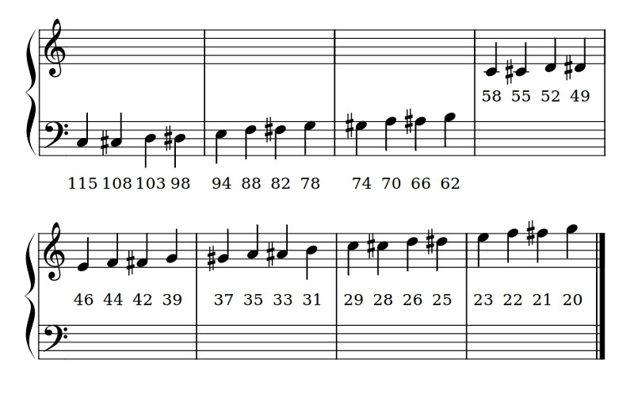
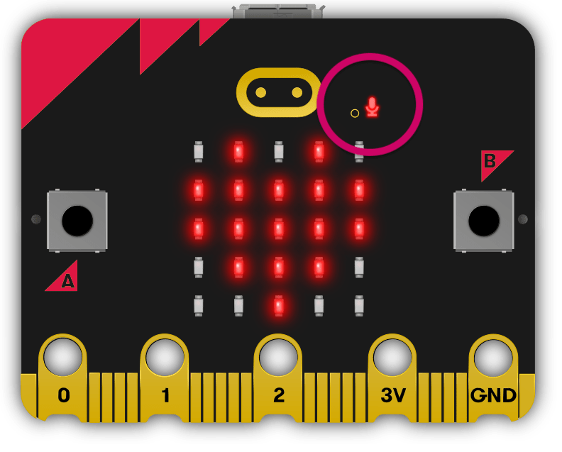

# Micro:bit Sound

<iframe width="560" height="315" src="https://www.youtube-nocookie.com/embed/r53PjFwyAhw" title="YouTube video player" frameborder="0" allow="accelerometer; autoplay; clipboard-write; encrypted-media; gyroscope; picture-in-picture; web-share" allowfullscreen></iframe>

MicroPython on the BBC micro:bit comes with music, speech, and microphone tools. These tools let you play sounds, make simple speech, and respond to noise.

```{admonition} Documentation
:class: important
Sound features are explained in the **[BBC micro:bit MicroPython music documentation](https://microbit-micropython.readthedocs.io/en/v2-docs/music.html)**, **[BBC micro:bit MicroPython speech documentation](https://microbit-micropython.readthedocs.io/en/v2-docs/speech.html)**, and **[BBC micro:bit MicroPython microphone documentation](https://microbit-micropython.readthedocs.io/en/v2-docs/microphone.html)**.
```

## Music

```{admonition} Music
:class: important
Full details can be found at the **[BBC micro:bit MicroPython Music documentation](https://microbit-micropython.readthedocs.io/en/latest/music.html#module-music)**.
```

MicroPython on the BBC micro:bit can play music and sound through the built-in speaker.

### Built-in tunes

Notice that we import the music module. It contains methods used to make and control sound. For example:

```{literalinclude} ./python_files/sound_music_example/main.py
:linenos:
```

```{admonition} Code explanation
:class: notice
- **line 3** &rarr; imports the music module
- **line 5** &rarr; plays the built-in melody NYAN
```

MicroPython has quite a lot of built-in melodies: **[here is the complete list](https://microbit-micropython.readthedocs.io/en/latest/music.html#built-in-melodies)**.

### Custom Tunes

You can also create your own tunes.

Each **note** has a name, such as C# or F, an **octave**, which controls how high or low the note sounds, and a **duration**, which controls how long the note lasts.

**Octaves** are shown with a number. Octave `0` is very low, octave `4` contains middle C, and octave `8` is very high.

**Durations** are also shown with numbers. A higher duration lasts longer. For example, a duration of `4` lasts twice as long as a duration of `2`.

If you use the note name **R** then MicroPython will play a rest (i.e. silence) for the specified duration.

- Use **#** for a sharp note
- Use **b** for a flat note

Each note is expressed as a string of characters like this:

```
NOTE[octave][:duration]
```

For example, `"A1:4"` means note `A`, octave `1`, duration `4`.

Make a list of notes to create a melody. This is similar to creating an animation with a list of images. For example, this code plays the opening of "Frere Jacques":

```{literalinclude} ./python_files/sound_music_example_2/main.py
:linenos:
```

```{admonition} Code explanation
:class: notice
- **line 3** &rarr; imports the music module
- **line 5** &rarr; stores the notes of "Frere Jacques" in a list called `tunes`
- **line 7** &rarr; plays the notes stored in `tunes`
```

### Sound Effects

MicroPython lets you make tones that are not musical notes. For example, this code creates a siren sound effect:

```{literalinclude} ./python_files/sound_effects_example/main.py
:linenos:
```

This example uses the `music.pitch()` method. It needs a frequency. For example, `440` is the frequency of the note A used by many musicians when tuning instruments.

```{admonition} Code explanation
:class: notice
- **line 3** &rarr; imports the music module
- **line 5** &rarr; creates a loop that keeps running
- **line 6** &rarr; creates a loop where the value of `freq` runs from `880` to `1760` in steps of `16`
- **line 7** &rarr; plays the current value of `freq` for `6` milliseconds
- **line 8** &rarr; creates a loop where the value of `freq` runs from `1760` to `880` in steps of `-16`
- **line 9** &rarr; plays the current value of `freq` for `6` milliseconds
```

## Speech

The micro:bit can also make simple speech sounds. This can be a fun way to give information, create alerts, or add a voice to a project. The speech is made by a simple speech synthesiser based on older computer voice technology, so it sounds robotic rather than natural.

```{admonition} Speech
:class: important
Full details can be found at the **[BBC micro:bit MicroPython Speech documentation](https://microbit-micropython.readthedocs.io/en/latest/speech.html)**.
```

### Say

The simplest way to get the micro:bit to speak is to import the speech module and use the `say()` function like this:

```{literalinclude} ./python_files/speech_example_1/main.py
:linenos:
```

```{admonition} Code explanation
:class: notice
- **line 3** &rarr; imports the speech module
- **line 5** &rarr; makes the micro:bit say **Hello world**
```

You can change the voice by adjusting four settings:

- `pitch` - how high or low the voice sounds
- `speed` - how quickly the device talks
- `mouth` - how open or closed the voice sounds
- `throat` - how bright or deep the voice sounds

Together, these settings control the **timbre** of the voice. Timbre means the sound quality or character of a sound. The best way to find a voice you like is to test different values and listen to the result.

To adjust the settings, pass them into the `say()` function. **[More details can be found in the speech module API documentation](https://microbit-micropython.readthedocs.io/en/latest/speech.html#timbre)**.

This example changes the voice settings:

```{literalinclude} ./python_files/speech_example_2/main.py
:linenos:
```

```{admonition} Code explanation
:class: notice
- **line 3** &rarr; imports the speech module
- **line 8** &rarr; stores the message in a variable
- **line 17** &rarr; makes the micro:bit say the message
```

### Pronounce

Sometimes the `say()` function does not turn English words into the sound you expect. To control the exact sounds, use **phonemes**. Phonemes are the small sounds that make up spoken words.

When you use phonemes, you write the word the way it sounds, not the way it is normally spelled.

A **[full list of phonemes](https://microbit-micropython.readthedocs.io/en/latest/speech.html#phonemes)** is available in the speech documentation. You can also pass English words into the **[translate function](https://microbit-micropython.readthedocs.io/en/latest/speech.html#speech.translate)**. It returns a first version of the phonemes that the speech synthesiser would use. You can then edit the result to improve how it sounds.

The `pronounce()` function is used for phoneme output like this:

```{literalinclude} ./python_files/speech_example_3/main.py
:linenos:
```

```{admonition} Code explanation
:class: notice
- **line 3** &rarr; imports the speech module
- **line 5** &rarr; pronounces the phoneme sounds in `"MAOREHTUN BEY5 BOYZ KAALIY4J"`
```

### Sing

By changing the pitch setting and calling the `sing()` function, you can make the device sing simple notes.

The mapping from pitch numbers to musical notes is shown below:



Annotations work by adding a hash sign (`#`) and a pitch number before the phoneme. The pitch stays the same until a new annotation is given. For example, this code makes MicroPython sing a scale:

```{literalinclude} ./python_files/sing_example_1/main.py
:linenos:
```

```{admonition} Code explanation
:class: notice
- **lines 5 - 14** &rarr; creates a list of sung sounds, for example:
  - `#115` &rarr; the note
  - `DOWWWWWW` &rarr; the sound to sing
- **line 15** &rarr; joins all the strings in the `solfa` list into one string called `song`
- **line 16** &rarr; sings `song`
```

To make a sung note last longer, repeat vowel sounds or voiced consonant sounds, as shown in the example above. Some sounds are made from more than one part. For example, `"OY"` can be stretched as `"OHOHIYIYIY"`.

Experiment, listen carefully, and adjust how many times you repeat each phoneme.

## Microphone

The built-in microphone available on the micro:bit V2 can be used to respond to sound. 

```{admonition} Microphone
:class: important
All the Microphone functions can be found in the **[BBC micro:bit MicroPython Microphone documentation](https://microbit-micropython.readthedocs.io/en/v2-docs/microphone.html)**.
```

The microphone input is located on the front of the board alongside a microphone activity LED, which is lit when the microphone is in use.



### Sound Events

The microphone can respond to built-in sound events based on how loud the sound is.

- `microbit.SoundEvent.QUIET` &rarr; sound changes from loud to quiet
- `microbit.SoundEvent.LOUD` &rarr; sound changes from quiet to loud

For example:

```{literalinclude} ./python_files/microphone_example/main.py
:linenos:
```

### Sound level

The microphone can also give a sound level reading from `0` to `255`.

For example:

```{literalinclude} ./python_files/microphone_example_2/main.py
:linenos:
```

## Sound exercises

1. Create a program that plays your own tune
2. Create a program that sings the College Song
3. Create a program that lights up the display based on how loud the sound is
