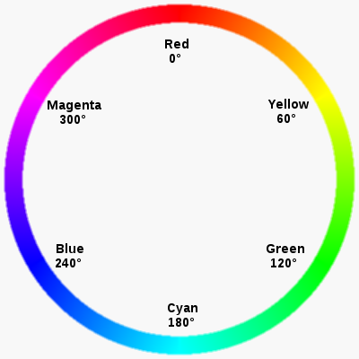

# PiicoDev Colour Sensor

<iframe width="560" height="315" src="https://www.youtube-nocookie.com/embed/d6Ot4NlOBfo" title="YouTube video player" frameborder="0" allow="accelerometer; autoplay; clipboard-write; encrypted-media; gyroscope; picture-in-picture; web-share" allowfullscreen></iframe>

The PiicoDev Colour Sensor allows you to differentiate colour hues and classify objects based on their colour.

## Colour Theory

### Red, Green Blue

The **Red**, **Green**, **Blue** (**RGB**) colour model is an additive colour model, meaning that it mixes (adds) Red, Green and Blue light to create many colours. RGB is used for displaying the colours on the screen you are reading this article - each pixel emits a certain amount of Red, Green, and Blue light, which - when mixed - creates the colours you're seeing.

### Hue, Saturation, Value (Brightness)

**Hue** is a property that describes the colour of the colour - the colour's identity - red, green, blue, yellow etc. Hue does not describe anything about how bright or intense the colour is.

**Saturation** is the intensity of colour; A bright red has high saturation, as opposed to a reddish-grey, which has very low saturation.

**Value** is the amount of light in a colour - A light red has a high value, a dark red has a low value. Usually, this is directly related to light; where there’s light there’s a high-value colour and the opposite in the shadow.

The HSV model is really useful for identifying or classifying colours because the hue property is the base colour. Hue is represented as an angle on a colour wheel, so you can identify a colour using a single variable - the angle. Referring to the colour wheel below, Red is described with a zero-angle, moving through to Green at 120 degrees, Blue at 240 degrees, and back to Red.



## Getting set up

### Connect the PiicoDev sensor to your Micro:bit

Plug your Micro:bit into the PiicoDev adapter (buttons LED matrix facing up), connect your sensor to the adapter via the PiicoDev cable and connect your Micro:bit to your computer with a USB lead.

### Download the PiicoDev Modules and Example Code

Create a new folder for this example. Then download the following files and save them to your new folder (Right Click > "Save Link As").

- **[`PiicoDev_Unified.py`](https://raw.githubusercontent.com/CoreElectronics/CE-PiicoDev-Unified/main/min/PiicoDev_Unified.py)** - The PiicoDev Unified Libraries: Drives I2C communications for PiicoDev modules
- **[`PiicoDev_VEML6040.py`](https://raw.githubusercontent.com/CoreElectronics/CE-PiicoDev-VEML6040-MicroPython-Module/main/min/PiicoDev_VEML6040.py)** - The device driver.
- **[`main.py`](https://raw.githubusercontent.com/CoreElectronics/CE-PiicoDev-VEML6040-MicroPython-Module/main/main.py)** - an example script for this PiicoDev Sensor

## Example code

The PiicoDev Team has included two examples in the `main.py`.

### Example 1

If you the `main.py` without making any changes you will get a printout reading of the RGB values being picked up by the sensor.

```{literalinclude} ./python_files/piico_colour_example/main.py
:linenos:
```

Exploring the important parts of that code:

- **line 6**: imports all the commands for the atmospheric sensor from the PiicoDev_VEML6040 library
- **line 7**: import the `sleep_ms` command from the PiicoDev_Unified library and is used the same as `sleep`
- **line 15**: labels the Colour Sensor as `sensor`
- **line 19**: gets a reading from the sensor which returns a dictionary
- **line 20**: extracts the **red** value from the returned dictionary
- **line 21**: extracts the **green** value from the returned dictionary
- **line 20**: extracts the **blue** value from the returned dictionary
- **line 24**: prints the **red**, **green** and **blue** values

## Example 2

Change the code in `main.py` to the same as the code below (make sure that the indentation of lines 27-30 is correct). This code will get a reading and classify what the sensor is looking at by using the values in the `fruitList`.

```{literalinclude} ./python_files/piico_colour_example_2/main.py
:linenos:
```

Exploring the important parts of that code:

- **line 6**: imports all the commands for the atmospheric sensor from the PiicoDev_VEML6040 library
- **line 7**: import the `sleep_ms` command from the PiicoDev_Unified library and is used the same as `sleep`
- **line 15**: labels the Colour Sensor as `sensor`
- **line 27**: gets a HSV reading which returns a dictionary
- **line 28**: extract the hue value from the dictionary
- **line 29**: gets a hue reading and then returns the closest key from the provided dictionary
  - if no dictionary is provided it will use a default dictionary of red, yellow, green, cyan, blue and magenta.
- **line 30**: prints the results from the two readings

## Commands

Below are the different commands available for the Atmospheric Sensor

### `readRGB()`

Returns a dictionary with the Red, Green & Blue colour space.

| Parameter | Type | Unit | Description |
| --- | --- | --- | --- |
| red | float | | Red reading |
| green | float | | Green reading |
| blue | float | | Blue reading |
| white | float | Lux | Ambient light |
| cct | float | K | Colour temperature |

### `readHSV()`

Returns a dictionary with the Hue Saturation Value colour space.

| Parameter | Type | Unit | Description |
| --- | --- | --- | --- |
| hue | float | | Hue reading |
| sat | float | | Saturation reading |
| val | float | | Value reading |

### classifyHue(hues, min_brightness)

Returns a classification of the hue.

Default values:
``` python
hues={
    "red":0,
    "yellow":60,
    "green":120,
    "cyan":180,
    "blue":240,
    "magenta":300
    }

min_brightness=0
```

## Exercises

1. Write a program that will print the full return dictionary of a `readRGB` every second
2. Write a program that will print the full return dictionary of a `readHSV` every second