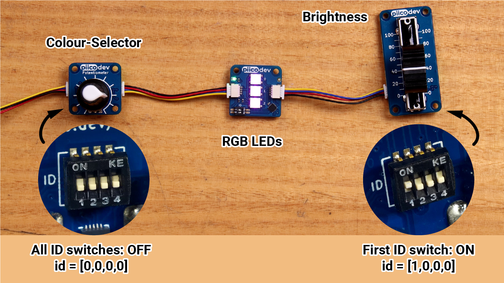

# PiicoDev Potentiometers

<iframe width="560" height="315" src="https://www.youtube-nocookie.com/embed/eD8h_VAoV90" title="YouTube video player" frameborder="0" allow="accelerometer; autoplay; clipboard-write; encrypted-media; gyroscope; picture-in-picture; web-share" allowfullscreen></iframe>

**Potentiometers** (pots) provide an intuitive, analogue way to control to your project. Turn the knob or slide the slider to return different values. 

## Getting set up

### Connect the PiicoDev module to your Micro:bit

Plug your Micro:bit into the PiicoDev adapter (buttons LED matrix facing up), connect your module to the adapter via the PiicoDev cable and connect your Micro:bit to your computer with a USB lead.

### Download the PiicoDev Modules

The **Rotary** and **Slide Potentiometers** use the same code.

Create a new folder for this example. Then download the following files and save them to your new folder (Right Click > "Save Link As").

- **[`PiicoDev_Unified.py`](https://raw.githubusercontent.com/CoreElectronics/CE-PiicoDev-Unified/main/min/PiicoDev_Unified.py)** - The PiicoDev Unified Libraries: Drives I2C communications for PiicoDev modules
- **[`PiicoDev_Potentiometer.py`](https://github.com/CoreElectronics/CE-PiicoDev-Potentiometer-MicroPython-Module/raw/main/min/PiicoDev_Potentiometer.py)** - The device driver.

## Examples

### Getting Values

First lets see how to get a value from the pot.

Create a new file called `main.py` and add the code below.

**[Upload](12_piicodev_intro.md#uploading)** `main.py` along with `PiicoDev_Unified.py` and `PiicoDev_Potentiometer.py` to the micro:bit and then **run** it.

```{literalinclude} ./python_files/piico_pot_example_1/main.py
:linenos:
```

### Changing Scale

The default scale is `0` - `100`. What if you want it to be something else? For example, `16` - `42`.

Change your `main.py` to the code below.

**[Upload](12_piicodev_intro.md#uploading)** `main.py` along with `PiicoDev_Unified.py` and `PiicoDev_Potentiometer.py` to the micro:bit and then **run** it.

```{literalinclude} ./python_files/piico_pot_example_2/main.py
:linenos:
```

### Using Multiple Pots

Each pot module has a four bit id switch on its back. This allows up to 16 different pots to be daisy-chained together. Each pot must be given a unique addressing using the id switches (see, example below)



#### Setup

Before running this code, we need to change the hardware. Daisy-chain a rotary pot and a slide pot together. Keep the rotary pot's address as 0,0,0,0 and change the slide pot's address to 1,0,0,0 (just like the image above).

Then change your `main.py` code to the code below:

```{literalinclude} ./python_files/piico_pot_example_3/main.py
:linenos:
```
