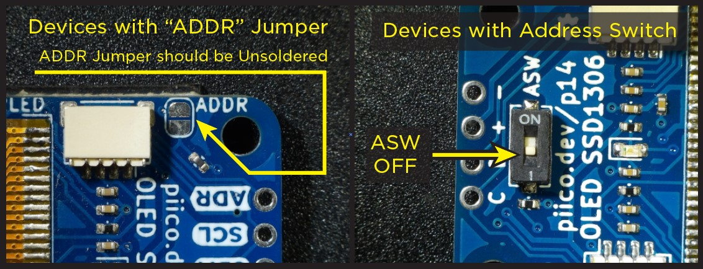

# PiicoDev OLED Module

<iframe width="560" height="315" src="https://www.youtube-nocookie.com/embed/xEcLUxhMMDY" title="YouTube video player" frameborder="0" allow="accelerometer; autoplay; clipboard-write; encrypted-media; gyroscope; picture-in-picture; web-share" allowfullscreen></iframe>

The PiicoDev OLED Display Module is perfect for adding a graphical display to your project. The monochrome white-on-black display provides a sharp image and fits a surprising amount of detail. Use this module to display text, draw shapes, animations, and even create plots.

## Getting set up

### Connect the PiicoDev module to your Micro:bit

Plug your Micro:bit into the PiicoDev adapter (buttons LED matrix facing up), connect your module to the adapter via the PiicoDev cable and connect your Micro:bit to your computer with a USB lead.

Make sure that the ASW switch is in the off position (see below)



### Download the PiicoDev Modules

Create a new folder for this example. Then download the following files and save them to your new folder (Right Click > "Save Link As").

- **[`PiicoDev_Unified.py`](https://raw.githubusercontent.com/CoreElectronics/CE-PiicoDev-Unified/main/min/PiicoDev_Unified.py)** - The PiicoDev Unified Libraries: Drives I2C communications for PiicoDev modules
- **[`PiicoDev_SSD1306.py`](https://raw.githubusercontent.com/CoreElectronics/CE-PiicoDev-SSD1306-MicroPython-Module/main/min/PiicoDev_SSD1306.py)** - The device driver.
- **[`font-pet-me-128.dat`](https://github.com/CoreElectronics/CE-PiicoDev-SSD1306-MicroPython-Module/raw/main/font-pet-me-128.dat)** - The font file
- **[`piicodev-logo.pbm`](https://github.com/CoreElectronics/CE-PiicoDev-SSD1306-MicroPython-Module/raw/main/bitmap/piicodev-logo.pbm)** - PiicoDev Test Image

## Examples

The PiicoDev OLED Module screen has 128 pixels x 64 pixels, with the `(0,0)` coordinate in the top lefthand corner.

### Line

There are several options for drawing simple lines.

- `line(x1, y1, x2, y2, c)` will draw a two-point line from `(x1,y1)` to `(x2,y2)` of colour `c`.
- `hline(x, y, l, c)` will draw a horizontal line from `(x, y)` of length `l`, colour `c`. Always draws left-to-right.
- `vline(x, y, l, c)` will draw a verticle line from `(x, y)` of length `l`, colour `c`. Always draws left-to-right.

The following example draws horizontal and vertical lines from the same point and joins their ends with a two-point line. There is a small delay between the drawing of each line.

**Create** a `main.py` file in the folder and add the code below.

**[Upload](12_piicodev_intro.md#uploading)** `main.py` along with `PiicoDev_Unified.py`, `PiicoDev_SSD1306.py`, `font-pet-me-128.dat` and `piicodev-logo.pbm` to the micro:bit and then **run** it.

```{literalinclude} ./python_files/oled_example_1/main.py
:linenos:
```

### Rectangle

Draw an unfilled rectangle with `rect(x,y,width,height,colour)`

The top-left corner is specified by `x` and `y`. `width` and `height` set the width and height in pixels. `colour` sets the line colour as `1` (white) or `0` (black)

The following example draws an unfilled rectangle to the left of the display, and a filled white rectangle to the right. A filled black rectangle is then drawn over the top.

Change the code in `main.py` to the code below. 

**[Upload](12_piicodev_intro.md#uploading)** `main.py` along with `PiicoDev_Unified.py`, `PiicoDev_SSD1306.py`, `font-pet-me-128.dat` and `piicodev-logo.pbm` to the micro:bit and then **run** it.

```{literalinclude} ./python_files/oled_example_2/main.py
:linenos:
```

### Text

Display alphanumeric text with `text(string, x, y, colour)`, where;

- `string` is a python string
- `x`, `y` are the top-left co-ordinates
- `colour` is `1` (white) or `0` (black)

The following example prints four lines. The first is a literal string, where the text to be printed is inserted into the function call. The second prints a string variable myString. The third and fourth print the value stored in a variable.

Change the code in `main.py` to the code below. 

**[Upload](12_piicodev_intro.md#uploading)** `main.py` along with `PiicoDev_Unified.py`, `PiicoDev_SSD1306.py`, `font-pet-me-128.dat` and `piicodev-logo.pbm` to the micro:bit and then **run** it.

```{literalinclude} ./python_files/oled_example_3/main.py
:linenos:
```

### Graph

Graphs are created with the `graph2D()` function allows plotting a single variable as it changes over time. The plot starts at the right-hand side of the display and shifts to the left every time it is updated.

`updateGraph2D(graph, value)` pushes the latest value onto a graph object. Multiple graphs can be shown at the same time and must be updated by making separate calls to updateGraph2D().

The following example graphs two functions independently.

Change the code in `main.py` to the code below. 

**[Upload](12_piicodev_intro.md#uploading)** `main.py` along with `PiicoDev_Unified.py`, `PiicoDev_SSD1306.py`, `font-pet-me-128.dat` and `piicodev-logo.pbm` to the micro:bit and then **run** it.

```{literalinclude} ./python_files/oled_example_4/main.py
:linenos:
```

### Animation

In general, the steps to create an animation are:

- Clear the display (we generally don't want to draw over old frames)
- Draw a frame - this is usually generated by some variable that changes with time.
- Update the display

The following example animates a rectangle bouncing around the screen.

Change the code in `main.py` to the code below. 

**[Upload](12_piicodev_intro.md#uploading)** `main.py` along with `PiicoDev_Unified.py`, `PiicoDev_SSD1306.py`, `font-pet-me-128.dat` and `piicodev-logo.pbm` to the micro:bit and then **run** it.

```{literalinclude} ./python_files/oled_example_5/main.py
:linenos:
```

### Bitmap Images

It is possible to display Portable Bitmap Images (.pbm) files on our OLED module. The source image needs to be uploaded to our micro:bit just like any other source file. 

```{admonition} Memory limitations
:class: error
Beware: the memory on a micro:bit is very limited and bitmap images will take a while to display.
```

The following example displays the PiicoDev logo on the screen.

Change the code in `main.py` to the code below. 

**[Upload](12_piicodev_intro.md#uploading)** `main.py` along with `PiicoDev_Unified.py`, `PiicoDev_SSD1306.py`, `font-pet-me-128.dat` and `piicodev-logo.pbm` to the micro:bit and then **run** it.

```{literalinclude} ./python_files/oled_example_6/main.py
:linenos:
```

