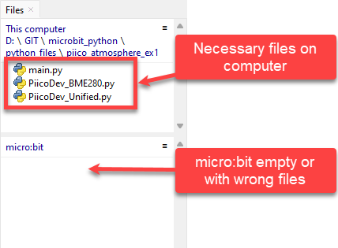
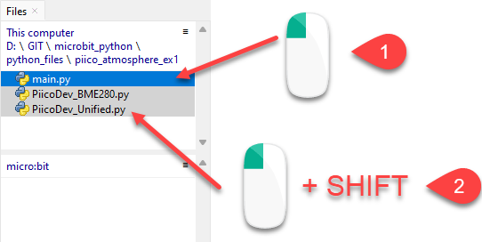
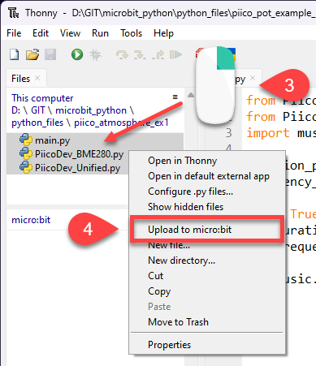
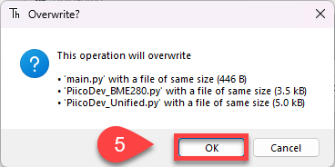

# PiicoDev Intro

PiicoDev hardware is designed for quick prototyping and learning electronics. This product range is made by the Australian business [Core Electronics](https://core-electronics.com.au/). Core Electronics also provides tutorials for many electronics projects.

## Using the PiicoDev modules

Unlike the micro:bit modules, the code that runs the PiicoDev modules is not installed on the micro:bit. This means that you will need to download files and save them to the folder containing your `main.py` file. These files are:

- **PiicoDev Unified Libraries** &rarr; `PiicoDev_Unified.py`
  - provides the commands for all the PiicoDev modules
  - you only need one of these in each folder
- **The device driver**
  - this is different for each PiicoDev module
  - you will need a device driver for each different PiicoDev module you are using. For example, if you are using the Distance Sensor and the OLED Module, you will need a device driver for both of these.

These files can be found on the micro:bit guides for the PiicoDev modules:

### Input Devices

- [PiicoDev Atmospheric Sensor](https://core-electronics.com.au/guides/piicodev-atmospheric-sensor-bme280-quickstart-guide-for-microbit/)
- [PiicoDev Colour Sensor](https://core-electronics.com.au/guides/micro-bit/piicodev-colour-sensor-veml6040-micro-bit-guide/)
- [PiicoDev Distance Sensor](https://core-electronics.com.au/guides/piicodev-distance-sensor-vl53l1x-micro-bit-guide/)
- [PiicoDev Rotary Potentiometer](https://core-electronics.com.au/guides/piicodev-potentiometer-getting-started-guide/#ONVMI66)
- [PiicoDev Slide Potentiometer](https://core-electronics.com.au/guides/piicodev/piicodev-potentiometer-getting-started-guide/#ONVMI66)

### Output Devices

- [PiicoDev OLED Module](https://core-electronics.com.au/guides/micro-bit/piicodev-oled-ssd1306-microbit-guide/)

## Uploading to the micro:bit 

To use the PiicoDev components, you **must** upload the **PiicoDev Unified Libraries** and the relevant **device drivers** to the micro:bit along with `main.py`.

The images below show how to upload the atmospheric sensor files onto the micro:bit:

### Before

### Uploading

1. Click the first file
2. Hold the **Shift** key and click the bottom file

3. Right-click the selected files
4. Select **Upload to micro:bit** from the pop-up menu

5. If files with the same names are already on the micro:bit, Thonny may ask if you want to overwrite them. Click **OK**.

