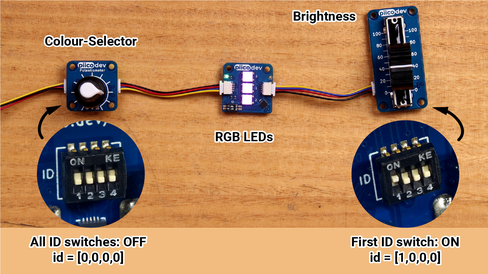

# PiicoDev Potentiometers

<iframe width="560" height="315" src="https://www.youtube-nocookie.com/embed/eD8h_VAoV90" title="YouTube video player" frameborder="0" allow="accelerometer; autoplay; clipboard-write; encrypted-media; gyroscope; picture-in-picture; web-share" allowfullscreen></iframe>

**Potentiometers** (pots) provide an intuitive, analogue way to control to your project. Turn the knob or slide the slider to return different values. 

## Examples

### Getting Values
1. Stop the program running on your micro:bit by clicking the **Stop** button in Thonny.
2. Open the **23_piico_pot_example_1** folder in Thonny.
3. Check that the following files are in the folder:
   - `main.py`
   - `PiicoDev_Unified.py` - Drives I2C communications for PiicoDev modules
   - `PiicoDev_Potentiometer.py` - The device driver for the PiicoDev Potentiometer
4. To run the program you will need to upload all three files to the micro:bit. To do this, select all three files in the file browser, right-click and select **Upload to micro:bit**.
5. Open `main.py` and your should see the code below

```{literalinclude} ./python_files/23_piico_pot_example_1/main.py
:linenos:
```

### Changing Scale

The default scale is `0` - `100`. What if you want it to be something else? For example, `16` - `42`.

1. Stop the program running on your micro:bit by clicking the **Stop** button in Thonny.
2. Open the **23_piico_pot_example_2** folder in Thonny.
3. Check that the following files are in the folder:
   - `main.py`
   - `PiicoDev_Unified.py` - Drives I2C communications for PiicoDev modules
   - `PiicoDev_Potentiometer.py` - The device driver for the PiicoDev Potentiometer
4. To run the program you will need to upload all three files to the micro:bit. To do this, select all three files in the file browser, right-click and select **Upload to micro:bit**.
5. Open `main.py` and your should see the code below

```{literalinclude} ./python_files/23_piico_pot_example_2/main.py
:linenos:
```

### Using Multiple Pots

Each pot module has a four bit id switch on its back. This allows up to 16 different pots to be daisy-chained together. Each pot must be given a unique addressing using the id switches (see, example below)



**Setup**

Before running this code, we need to change the hardware. Daisy-chain a rotary pot and a slide pot together. Keep the rotary pot's address as 0,0,0,0 and change the slide pot's address to 1,0,0,0 (just like the image above).

1. Stop the program running on your micro:bit by clicking the **Stop** button in Thonny.
2. Open the **23_piico_pot_example_1** folder in Thonny.
3. Check that the following files are in the folder:
   - `main.py`
   - `PiicoDev_Unified.py` - Drives I2C communications for PiicoDev modules
   - `PiicoDev_Potentiometer.py` - The device driver for the PiicoDev Potentiometer
4. To run the program you will need to upload all three files to the micro:bit. To do this, select all three files in the file browser, right-click and select **Upload to micro:bit**.
5. Open `main.py` and your should see the code below

```{literalinclude} ./python_files/23_piico_pot_example_3/main.py
:linenos:
```
