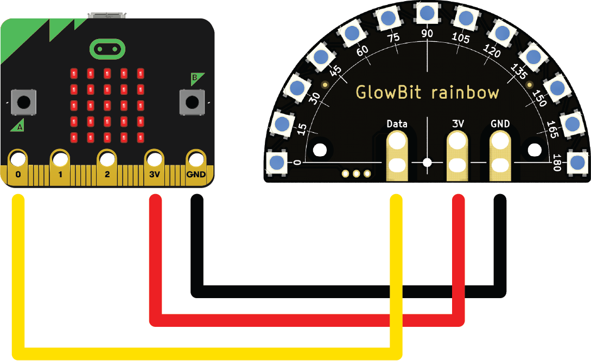

# Glowbit Rainbow

<iframe width="560" height="315" src="https://www.youtube-nocookie.com/embed/VFJ50tXNEbA" title="YouTube video player" frameborder="0" allow="accelerometer; autoplay; clipboard-write; encrypted-media; gyroscope; picture-in-picture; web-share" allowfullscreen></iframe>

The GlowBi rainbow is a beautiful LED display featuring 13 individually addressable LEDs and easy alligator / banana-plug connections.

## Wire a rainbow to a micro:bit

It's best to unpower your micro:bit when wiring - make sure the USB lead or any batteries are disconnected for this bit.

- Use the Black alligator clips to connect GND on the micro:bit to GND on the rainbow
- Use the Red alligator clips to connect 3V on the micro:bit to 3V on the rainbow
- Use the Yellow alligator clips to connect 0 on the micro:bit to Data on the rainbow



## Example

**Create** a new folder a for this example, and then **create** a new file called `main.py` in it. Then add the code below to it. Save it, **upload** it to the mirco:bit and the **run** it.

```{literalinclude} ./python_files/glow_bit_rainbow/main.py
:linenos:
```