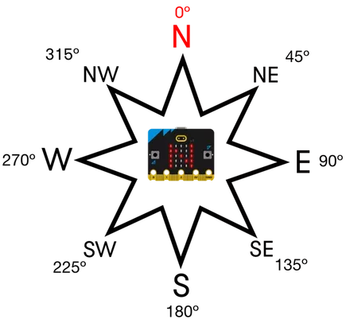

# Compass

!!! learn "On this page we will learn"
    - how to calibrate the compass
    - how to find which direction the micro:bit is pointing
    - how to measure magnetic field strength

!!! terms "Terminology"
    - **magnetometer** – a sensor that measures magnetic fields, used by the micro:bit as a compass.
    - **magnetic field** – the invisible area of magnetic force around a magnet or the Earth.
    - **calibration** – testing and adjusting a sensor or device so its readings or movements are accurate.
    - **heading** – the direction something is facing, measured in degrees.
    - **nanotesla** – a very small unit for measuring the strength of a magnetic field.

<iframe width="560" height="315" src="https://www.youtube-nocookie.com/embed/a3P6LWwPBqM" title="YouTube video player" frameborder="0" allow="accelerometer; autoplay; clipboard-write; encrypted-media; gyroscope; picture-in-picture; web-share" allowfullscreen></iframe>

The compass (a **magnetometer**) measures magnetic fields, so it can find which direction the micro:bit is pointing and detect nearby magnets.

Possible uses:

- navigation tools
- treasure hunts
- magnet-triggered switches

## Connect it

The compass is built into the micro:bit, so we don't need to connect anything.

- Each example is a `main.py` file. See [Your First Program](../micropython/first-program.md) for how to create, upload and run it.
- The compass must be **calibrated** before it gives headings. Calibration starts automatically the first time a heading is needed: tilt the micro:bit in every direction until all the LEDs are lit.
- Headings are measured from the top of the micro:bit (the USB socket end), from `0` to `359` degrees. For example, pointing South-East gives `135`.



## Set it up

The compass is part of the `microbit` library. We import it at the top of every program:

```python linenums="1"
from microbit import *
```

## Methods

| Method | Parameters | Returns | Description |
| --- | --- | --- | --- |
| `compass.calibrate()` | none | none | Starts the calibration game |
| `compass.is_calibrated()` | none | Boolean | `True` if the compass has been calibrated |
| `compass.heading()` | none | int (0–359) | The direction the micro:bit is pointing, in degrees |
| `compass.get_field_strength()` | none | int (nanotesla) | The strength of the magnetic field around the micro:bit |

### `compass.calibrate()`

Starts the calibration game: tilt the micro:bit until every LED is lit.

```python linenums="1"
--8<-- "examples/microbit/compass/calibrate/main.py"
```

!!! primm "PRIMM"
    1. **Predict** what you think will happen. Be specific.
    2. **Run** the program.
    3. Time to **investigate** the code. What does each line do?

??? note "Code explanation"
    - **line 1** → imports all the commands from the `microbit` library.
    - **line 4** → starts calibration. Tilt the micro:bit until every LED is lit.
    - **line 7** → starts an endless loop.
    - **line 8** → shows a tick once calibration is finished.

### `compass.is_calibrated()`

Checks whether the compass has been calibrated.

```python linenums="1"
--8<-- "examples/microbit/compass/is_calibrated/main.py"
```

!!! primm "PRIMM"
    1. **Predict** what you think will happen. Be specific.
    2. **Run** the program.
    3. Time to **investigate** the code. What does each line do?

??? note "Code explanation"
    - **line 1** → imports all the commands from the `microbit` library.
    - **line 4** → starts an endless loop.
    - **line 5** → prints `True` in the Shell if the compass has been calibrated, or `False` if it hasn't.
    - **line 6** → waits 1 second before the loop repeats.

### `compass.heading()`

Returns the direction the top of the micro:bit is pointing, from `0` to `359` degrees.

```python linenums="1"
--8<-- "examples/microbit/compass/heading/main.py"
```

!!! primm "PRIMM"
    1. **Predict** what you think will happen. Be specific.
    2. **Run** the program.
    3. Time to **investigate** the code. What does each line do?

??? note "Code explanation"
    - **line 1** → imports all the commands from the `microbit` library.
    - **line 4** → starts an endless loop.
    - **line 5** → gets the compass heading and scrolls it across the display.

### `compass.get_field_strength()`

Returns the strength of the magnetic field around the micro:bit. It goes up when a magnet is nearby.

```python linenums="1"
--8<-- "examples/microbit/compass/get_field_strength/main.py"
```

!!! primm "PRIMM"
    1. **Predict** what you think will happen. Be specific.
    2. **Run** the program.
    3. Time to **investigate** the code. What does each line do?

??? note "Code explanation"
    - **line 1** → imports all the commands from the `microbit` library.
    - **line 4** → starts an endless loop.
    - **line 5** → gets the magnetic field strength and scrolls it across the display.

## Documentation

Documentation is the official guide written by the people who made the code library, and we can use it to look up every method and its parameters, including ones that aren't covered on this page.

- [BBC micro:bit MicroPython — compass](https://microbit-micropython.readthedocs.io/en/v2-docs/compass.html)

## Exercises

!!! primm "PRIMM"
    Time to **modify** the code and see what happens.

Starter files are in the `compass` folder of your tutorial files. Solutions are on the [Exercise Solutions](../reference/solutions.md#compass) page.

### Exercise 1

Starter: `compass/ex1_north`

Can you make the micro:bit show `N` when it is pointing North?

### Exercise 2

Starter: `compass/ex2_eight_points`

Can you make the micro:bit show which of the 8 compass directions in the image above it is pointing (N, NE, E, SE, S, SW, W, NW) when button **A** is pressed?

### Exercise 3

Starter: `compass/ex3_microtesla`

Can you change the `get_field_strength()` example to show the reading in microtesla with no decimal places? (1 microtesla = 1000 nanotesla)

### Exercise 4

Starter: `compass/ex4_magnet`

Can you make the micro:bit show a happy face when a magnet is touching its right side, and an angry face otherwise?
