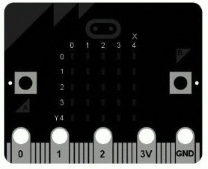
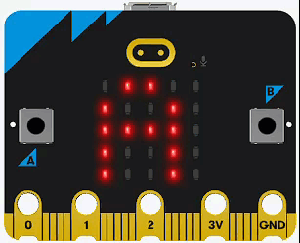
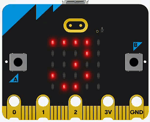
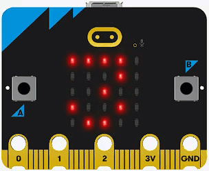
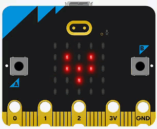
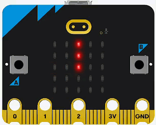
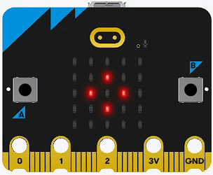
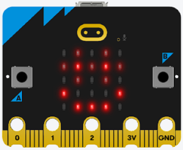

# Display

!!! learn "On this page we will learn"
    - how to scroll and show text and numbers
    - how to show built-in and custom images
    - how to turn individual pixels on and off
    - how to clear the display and turn it off and on

!!! terms "Terminology"
    - **LED** – a light-emitting diode, which is a small electronic light; the micro:bit display is a 5 × 5 grid of them.
    - **pixel** – a single dot of light on a display that can be turned on, off or set to a brightness.
    - **coordinates** – a pair of numbers `(x, y)` that give the position of a pixel, with `x` across and `y` down.
    - **method** – a command that belongs to an object, such as the display, and is written after a dot.
    - **parameter** – a value we give to a method inside its brackets to control what it does.
    - **return value** – the information a method gives back to our program after it runs.
    - **string** – a piece of text made of characters, written inside quotation marks.
    - **integer** – a whole number with no decimal point, written `int` in Python.
    - **float** – a number with a decimal point, such as `3.14`.
    - **Boolean** – a value that can only be `True` or `False`.
    - **documentation** – the official guide written by the people who made a code library, explaining every method and its parameters.

<iframe width="560" height="315" src="https://www.youtube-nocookie.com/embed/eRhlaXqT-0w" title="YouTube video player" frameborder="0" allow="accelerometer; autoplay; clipboard-write; encrypted-media; gyroscope; picture-in-picture; web-share" allowfullscreen></iframe>

The micro:bit display is a 5 × 5 grid of red LEDs that can show text, numbers, images and individual pixels at 10 brightness levels.

Possible uses:

- messages and scores
- sensor readings
- icons
- simple animations

## Connect it

The display is built into the micro:bit, so we don't need to connect anything.

- Each example is a `main.py` file. See [Your First Program](../micropython/first-program.md) for how to create, upload and run it.
- Pixels are located by `(x, y)` coordinates. `(0, 0)` is the top left and `(4, 4)` is the bottom right.
- Brightness goes from `0` (off) to `9` (brightest).



## Set it up

The display is part of the `microbit` library. We import it at the top of every program:

```python linenums="1"
from microbit import *
```

## Methods

| Method | Parameters | Returns | Description |
| --- | --- | --- | --- |
| `display.scroll(text, delay=150, wait=True, loop=False, monospace=False)` | `text`: string, int, float or Boolean<br>`delay`: ms per step | none | Scrolls text across the display |
| `display.show(value, delay=400, wait=True, loop=False, clear=False)` | `value`: image, string, number or list of images<br>`delay`: ms per character or image | none | Shows an image, or shows characters one at a time |
| `display.clear()` | none | none | Turns every pixel off |
| `display.set_pixel(x, y, value)` | `x`, `y`: 0–4<br>`value`: 0–9 | none | Sets the brightness of one pixel |
| `display.get_pixel(x, y)` | `x`, `y`: 0–4 | int (0–9) | Gets the brightness of one pixel |
| `display.on()` | none | none | Turns the display on |
| `display.off()` | none | none | Turns the display off |
| `display.is_on()` | none | Boolean | `True` if the display is on |

### `display.scroll()`

Scrolls text across the display from right to left.

```python linenums="1"
--8<-- "examples/microbit/display/scroll/main.py"
```

!!! primm "PRIMM"
    1. **Predict** what you think will happen. Be specific.
    2. **Run** the program.
    3. Time to **investigate** the code. What does each line do?

??? note "Code explanation"
    - **line 1** → imports all the commands from the `microbit` library.
    - **line 4** → starts an endless loop.
    - **line 5** → scrolls `"Hello world!"` across the display.

### `display.show()` — text and numbers

Shows characters one at a time instead of scrolling them.

```python linenums="1"
--8<-- "examples/microbit/display/show/main.py"
```

!!! primm "PRIMM"
    1. **Predict** what you think will happen. Be specific.
    2. **Run** the program.
    3. Time to **investigate** the code. What does each line do?

??? note "Code explanation"
    - **line 1** → imports all the commands from the `microbit` library.
    - **line 4** → starts an endless loop.
    - **line 5** → shows each character of `3.14159` one at a time.

### `display.show()` — images

The micro:bit has a range of [built-in images](https://microbit-micropython.readthedocs.io/en/v2-docs/image.html#attributes), such as `Image.HEART`, `Image.HAPPY` and `Image.ARROW_N`.

```python linenums="1"
--8<-- "examples/microbit/display/show_image/main.py"
```

!!! primm "PRIMM"
    1. **Predict** what you think will happen. Be specific.
    2. **Run** the program.
    3. Time to **investigate** the code. What does each line do?

??? note "Code explanation"
    - **line 1** → imports all the commands from the `microbit` library.
    - **line 4** → starts an endless loop.
    - **line 5** → shows the built-in heart image.

### `Image()` — custom images

Make your own image with a string of 25 brightness values: five rows of five digits, with each row ending in a colon (`:`).

```python linenums="1"
--8<-- "examples/microbit/display/custom_image/main.py"
```

!!! primm "PRIMM"
    1. **Predict** what you think will happen. Be specific.
    2. **Run** the program.
    3. Time to **investigate** the code. What does each line do?

??? note "Code explanation"
    - **line 1** → imports all the commands from the `microbit` library.
    - **lines 4–8** → creates a custom image called `boat`.
        - each string is one row, from top to bottom.
        - each digit is the brightness of one pixel, from left to right.
    - **line 11** → starts an endless loop.
    - **line 12** → shows the `boat` image.

### `display.clear()`

Turns every pixel off.

```python linenums="1"
--8<-- "examples/microbit/display/clear/main.py"
```

!!! primm "PRIMM"
    1. **Predict** what you think will happen. Be specific.
    2. **Run** the program.
    3. Time to **investigate** the code. What does each line do?

??? note "Code explanation"
    - **line 1** → imports all the commands from the `microbit` library.
    - **line 4** → starts an endless loop.
    - **line 5** → shows the built-in tick image.
    - **line 6** → waits 1 second.
    - **line 7** → clears the display.
    - **line 8** → waits 1 second before the loop repeats.

### `display.set_pixel()`

Sets the brightness of a single pixel.

```python linenums="1"
--8<-- "examples/microbit/display/set_pixel/main.py"
```

!!! primm "PRIMM"
    1. **Predict** what you think will happen. Be specific.
    2. **Run** the program.
    3. Time to **investigate** the code. What does each line do?

??? note "Code explanation"
    - **line 1** → imports all the commands from the `microbit` library.
    - **line 4** → starts an endless loop.
    - **line 5** → turns on the centre pixel `(2, 2)` at full brightness (`9`).

### `display.get_pixel()`

Reads the brightness of a single pixel.

```python linenums="1"
--8<-- "examples/microbit/display/get_pixel/main.py"
```

!!! primm "PRIMM"
    1. **Predict** what you think will happen. Be specific.
    2. **Run** the program.
    3. Time to **investigate** the code. What does each line do?

??? note "Code explanation"
    - **line 1** → imports all the commands from the `microbit` library.
    - **line 4** → sets the centre pixel to brightness `5`.
    - **line 7** → starts an endless loop.
    - **line 8** → reads the brightness of the centre pixel and prints it in the Thonny Shell.
    - **line 9** → waits 1 second before the loop repeats.

### `display.off()` and `display.on()`

Turns the whole display off and back on. The image is remembered while the display is off.

```python linenums="1"
--8<-- "examples/microbit/display/on_off/main.py"
```

!!! primm "PRIMM"
    1. **Predict** what you think will happen. Be specific.
    2. **Run** the program.
    3. Time to **investigate** the code. What does each line do?

??? note "Code explanation"
    - **line 1** → imports all the commands from the `microbit` library.
    - **line 4** → shows the built-in happy face.
    - **line 7** → starts an endless loop.
    - **line 8** → turns the display off.
    - **line 9** → waits 1 second.
    - **line 10** → turns the display back on, showing the happy face again.
    - **line 11** → waits 1 second before the loop repeats.

!!! tip
    Turning the display off frees pins 3, 4, 6, 7, 9 and 10 for other uses.

### `display.is_on()`

Checks whether the display is on.

```python linenums="1"
--8<-- "examples/microbit/display/is_on/main.py"
```

!!! primm "PRIMM"
    1. **Predict** what you think will happen. Be specific.
    2. **Run** the program.
    3. Time to **investigate** the code. What does each line do?

??? note "Code explanation"
    - **line 1** → imports all the commands from the `microbit` library.
    - **line 4** → starts an endless loop.
    - **line 5** → prints `True` in the Thonny Shell, because the display is on.
    - **line 6** → waits 1 second before the loop repeats.

## Documentation

Documentation is the official guide written by the people who made the code library, and we can use it to look up every method and its parameters, including ones that aren't covered on this page.

- [BBC micro:bit MicroPython — display](https://microbit-micropython.readthedocs.io/en/v2-docs/display.html)
- [BBC micro:bit MicroPython — Image](https://microbit-micropython.readthedocs.io/en/v2-docs/image.html)

## Exercises

!!! primm "PRIMM"
    Time to **modify** the code and see what happens.

Starter files are in the `display` folder of your tutorial files. Solutions are on the [Exercise Solutions](../reference/solutions.md#display) page.

### Exercise 1

Starter: `display/ex1_show_message`

Can you make it show a different message? For example:



### Exercise 2

Starter: `display/ex2_show_delay`

Can you change the time between each character? For example:



### Exercise 3

Starter: `display/ex3_show_no_loop`

Using the `display.show()` parameters in the methods table, can you show the same message repeatedly without the `while True` loop? For example:



### Exercise 4

Starter: `display/ex4_heartbeat`

Can you change the animation so it looks more like an [actual heartbeat](https://www.youtube.com/watch?v=gJpT_wHZeF8)? For example:



### Exercise 5

Starter: `display/ex5_clock`

Can you use the [built-in images](https://microbit-micropython.readthedocs.io/en/v2-docs/image.html#attributes) to show a clock face moving from 1 o'clock to 12 o'clock? For example:



### Exercise 6

Starter: `display/ex6_spinning_square`

Can you use the [built-in images](https://microbit-micropython.readthedocs.io/en/v2-docs/image.html#attributes) to show a spinning square? For example:



### Exercise 7

Starter: `display/ex7_no_sleep`

The starter code lights each pixel in turn, down each column. What happens if you remove `sleep(50)`? Why do you think this happens?

### Exercise 8

Starter: `display/ex8_rows`

The starter code moves a pixel down each column. Can you change it so the pixel moves across the rows instead? For example:


### Exercise 9

Starter: `display/ex9_glasses`

Can you create this smiley face with glasses? Custom images using `Image()` will help.


