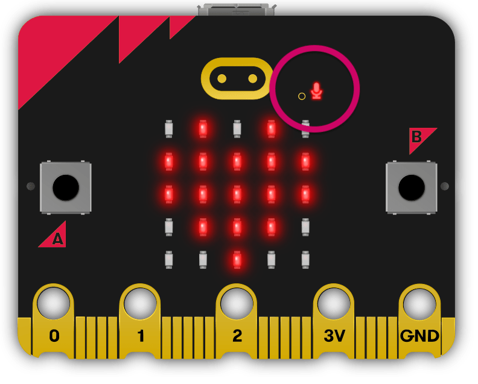
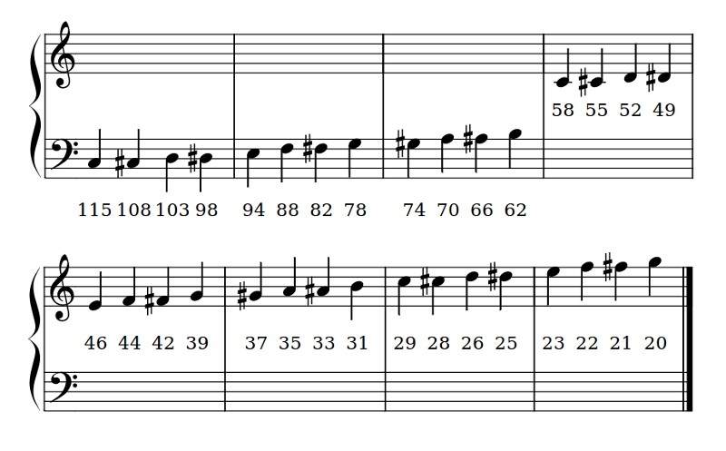

# Sound

<iframe width="560" height="315" src="https://www.youtube-nocookie.com/embed/r53PjFwyAhw" title="YouTube video player" frameborder="0" allow="accelerometer; autoplay; clipboard-write; encrypted-media; gyroscope; picture-in-picture; web-share" allowfullscreen></iframe>

The micro:bit v2 has a built-in speaker that plays tunes, tones and robotic speech, and a microphone that measures how loud it is.

Possible uses:

- game sound effects
- alarms
- talking projects
- sound-activated lights

## Connect it

The speaker and microphone are built into the micro:bit v2, so we don't need to connect anything.

- Each example is a `main.py` file. See [Your First Program](../micropython/first-program.md) for how to create, upload and run it.
- The microphone is on the front of the board. The LED next to it lights up while the microphone is in use.



## Set it up

Volume and the microphone are part of the `microbit` library. Music and speech each need their own module:

```python linenums="1"
from microbit import *
import music
import speech
```

Only import the modules your program uses.

### Writing notes

Custom tunes are lists of notes written as strings: `NOTE[octave][:duration]`

- **note** → `C` to `B`. Add `#` for sharp or `b` for flat. `R` is a rest (silence).
- **octave** → `0` (very low) to `8` (very high). Octave `4` contains middle C.
- **duration** → a higher number lasts longer. `4` lasts twice as long as `2`.

For example, `"A1:4"` is note A, octave 1, duration 4.

### Speech pitch

`speech.sing()` sets the pitch of each sound with `#` and a pitch number before the phoneme. The chart shows which pitch numbers match which notes.



## Methods

| Method | Parameters | Returns | Description |
| --- | --- | --- | --- |
| `set_volume(level)` | `level`: 0–255 | none | Sets the speaker volume |
| `music.play(music)` | `music`: built-in tune or list of notes | none | Plays a tune |
| `music.pitch(frequency, duration)` | `frequency`: Hz<br>`duration`: ms | none | Plays a tone at a frequency |
| `speech.say(words, pitch=64, speed=72)` | `words`: English string | none | Speaks English words |
| `speech.pronounce(phonemes)` | `phonemes`: phoneme string | none | Speaks exact sounds written as phonemes |
| `speech.sing(phonemes)` | `phonemes`: phonemes with pitch numbers | none | Sings phonemes at set pitches |
| `microphone.current_event()` | none | `SoundEvent` | `SoundEvent.LOUD` or `SoundEvent.QUIET` |
| `microphone.sound_level()` | none | int (0–255) | How loud the sound is |

### `set_volume()`

Sets how loud the speaker is, from `0` (silent) to `255` (loudest).

```python linenums="1"
--8<-- "examples/microbit/sound/set_volume/main.py"
```

!!! primm "PRIMM"
    1. **Predict** what you think will happen. Be specific.
    2. **Run** the program.
    3. Time to **investigate** the code. What does each line do?

??? note "Code explanation"
    - **line 1** → imports all the commands from the `microbit` library.
    - **line 2** → imports the `music` module.
    - **line 5** → sets the volume to `50` (out of `255`).
    - **line 8** → starts an endless loop.
    - **line 9** → plays the built-in `BA_DING` sound at the new volume.
    - **line 10** → waits 1 second before the loop repeats.

### `music.play()` — built-in tunes

Plays a tune through the speaker.

The micro:bit has many [built-in tunes](https://microbit-micropython.readthedocs.io/en/v2-docs/music.html#built-in-melodies).

```python linenums="1"
--8<-- "examples/microbit/sound/play_builtin/main.py"
```

!!! primm "PRIMM"
    1. **Predict** what you think will happen. Be specific.
    2. **Run** the program.
    3. Time to **investigate** the code. What does each line do?

??? note "Code explanation"
    - **line 1** → imports all the commands from the `microbit` library.
    - **line 2** → imports the `music` module.
    - **line 5** → starts an endless loop.
    - **line 6** → plays the built-in tune `NYAN`.

### `music.play()` — custom tunes

`music.play()` can also play your own tune, written as a list of notes (see [Writing notes](#writing-notes)).

```python linenums="1"
--8<-- "examples/microbit/sound/play_custom/main.py"
```

!!! primm "PRIMM"
    1. **Predict** what you think will happen. Be specific.
    2. **Run** the program.
    3. Time to **investigate** the code. What does each line do?

??? note "Code explanation"
    - **line 1** → imports all the commands from the `microbit` library.
    - **line 2** → imports the `music` module.
    - **line 5** → stores four notes, all in octave 4 with duration 4, in a list called `tune`.
    - **line 8** → starts an endless loop.
    - **line 9** → plays the notes in `tune`.

### `music.pitch()`

Plays a tone at any frequency, not just musical notes, which is useful for sound effects. `440` Hz is the note A that musicians tune to.

```python linenums="1"
--8<-- "examples/microbit/sound/pitch/main.py"
```

!!! primm "PRIMM"
    1. **Predict** what you think will happen. Be specific.
    2. **Run** the program.
    3. Time to **investigate** the code. What does each line do?

??? note "Code explanation"
    - **line 1** → imports all the commands from the `microbit` library.
    - **line 2** → imports the `music` module.
    - **line 5** → starts an endless loop.
    - **line 6** → plays a 440 Hz tone for 500 milliseconds.
    - **line 7** → waits 500 milliseconds, so the tone beeps.

### `speech.say()`

Speaks English words through the speaker.

The speech sounds robotic because it uses a simple speech synthesiser. You can change the voice with the `pitch` and `speed` parameters: a higher number gives a lower or slower voice.

```python linenums="1"
--8<-- "examples/microbit/sound/say/main.py"
```

!!! primm "PRIMM"
    1. **Predict** what you think will happen. Be specific.
    2. **Run** the program.
    3. Time to **investigate** the code. What does each line do?

??? note "Code explanation"
    - **line 1** → imports all the commands from the `microbit` library.
    - **line 2** → imports the `speech` module.
    - **line 5** → starts an endless loop.
    - **line 6** → says "Hello world".
    - **line 7** → waits 1 second before the loop repeats.

### `speech.pronounce()`

Speaks exact sounds, written as phonemes.

When `say()` doesn't sound right, write the word the way it sounds using [phonemes](https://microbit-micropython.readthedocs.io/en/v2-docs/speech.html#phonemes). `speech.translate()` gives you a starting point to edit.

```python linenums="1"
--8<-- "examples/microbit/sound/pronounce/main.py"
```

!!! primm "PRIMM"
    1. **Predict** what you think will happen. Be specific.
    2. **Run** the program.
    3. Time to **investigate** the code. What does each line do?

??? note "Code explanation"
    - **line 1** → imports all the commands from the `microbit` library.
    - **line 2** → imports the `speech` module.
    - **line 5** → starts an endless loop.
    - **line 6** → speaks the phonemes for "Moreton Bay Boys' College".
    - **line 7** → waits 1 second before the loop repeats.

### `speech.sing()`

Sings phonemes at set pitches.

Each note is a pitch number after `#`, followed by the sound to sing. To make a note last longer, repeat its vowel sounds, for example `"DOWWWWWW"`.

```python linenums="1"
--8<-- "examples/microbit/sound/sing/main.py"
```

!!! primm "PRIMM"
    1. **Predict** what you think will happen. Be specific.
    2. **Run** the program.
    3. Time to **investigate** the code. What does each line do?

??? note "Code explanation"
    - **line 1** → imports all the commands from the `microbit` library.
    - **line 2** → imports the `speech` module.
    - **line 5** → starts an endless loop.
    - **line 6** → sings three notes: "doh" at pitch `115`, "re" at pitch `103` and "mi" at pitch `94`.
    - **line 7** → waits 1 second before the loop repeats.

### `microphone.current_event()`

Returns `SoundEvent.LOUD` when the sound has just changed from quiet to loud, or `SoundEvent.QUIET` when it has just changed from loud to quiet.

```python linenums="1"
--8<-- "examples/microbit/sound/current_event/main.py"
```

!!! primm "PRIMM"
    1. **Predict** what you think will happen. Be specific.
    2. **Run** the program.
    3. Time to **investigate** the code. What does each line do?

??? note "Code explanation"
    - **line 1** → imports all the commands from the `microbit` library.
    - **line 4** → starts an endless loop.
    - **line 5** → checks if the sound has just changed from quiet to loud.
    - **line 6** → if it has, shows a big heart.
    - **line 7** → keeps the big heart on for 200 milliseconds.
    - **line 8** → if it hasn't…
    - **line 9** → …shows a small heart.

### `microphone.sound_level()`

Returns how loud the sound around the micro:bit is, from `0` (silent) to `255` (loud).

```python linenums="1"
--8<-- "examples/microbit/sound/sound_level/main.py"
```

!!! primm "PRIMM"
    1. **Predict** what you think will happen. Be specific.
    2. **Run** the program.
    3. Time to **investigate** the code. What does each line do?

??? note "Code explanation"
    - **line 1** → imports all the commands from the `microbit` library.
    - **line 4** → starts an endless loop.
    - **line 5** → gets the sound level and scrolls it across the display.

## Documentation

- [BBC micro:bit MicroPython — music](https://microbit-micropython.readthedocs.io/en/v2-docs/music.html)
- [BBC micro:bit MicroPython — speech](https://microbit-micropython.readthedocs.io/en/v2-docs/speech.html)
- [BBC micro:bit MicroPython — microphone](https://microbit-micropython.readthedocs.io/en/v2-docs/microphone.html)
- [BBC micro:bit MicroPython — set_volume](https://microbit-micropython.readthedocs.io/en/v2-docs/microbit.html#microbit.set_volume)

## Exercises

!!! primm "PRIMM"
    Time to **modify** the code and see what happens.

Starter files are in the `sound` folder of your tutorial files. Solutions are on the [Exercise Solutions](../reference/solutions.md#sound) page.

### Exercise 1

Starter: `sound/ex1_my_tune`

Can you create a program that plays your own tune?

### Exercise 2

Starter: `sound/ex2_college_song`

Can you create a program that sings the College Song?

### Exercise 3

Starter: `sound/ex3_sound_meter`

Can you light up the display based on how loud the sound is, with more LEDs for louder sounds?
