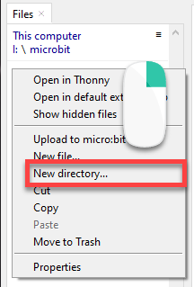
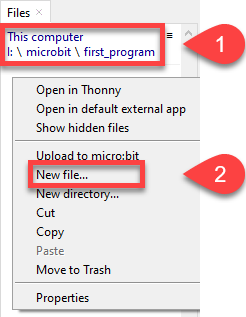
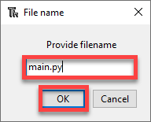
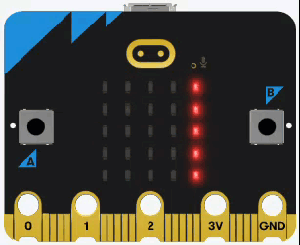
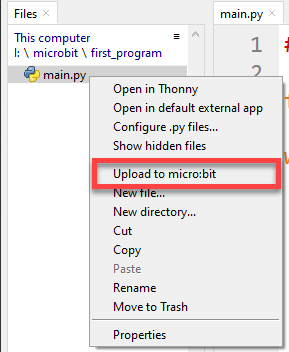
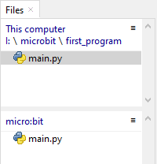
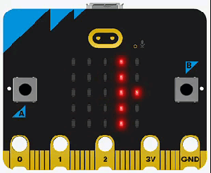
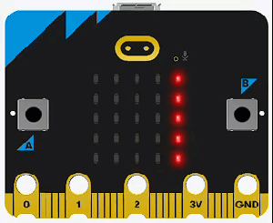

# Your First Program

!!! learn "On this page we will learn"
    - how MicroPython runs programs on the micro:bit
    - how to open, create, run and stop a program
    - what the PRIMM process is
    - how to upload a program so it runs by itself

Before we create our first program, we need to understand how MicroPython works. This page shows how we create, run and upload every program in this course. Come back here whenever you need a reminder.

## How MicroPython runs programs

When a micro:bit running MicroPython turns on, it looks for a file called `main.py` and runs it. A project can have other files, but it must have a `main.py`.

A folder can't have two files with the same name, so **every program gets its own folder** with its own `main.py`. That is why we have a separate folder for each example and exercise in the tutorial files.

## Open an example

1. In Thonny's Files panel, navigate to the **microbit_tutorials** folder.
2. Open the folder for the page you are working on (for example, `micropython`), then the folder for the example (for example, `first_program`).
3. Double-click `main.py` to open it.

## Create a new program

Use this when you want to write your own program.

1. In the Files panel, go to the folder where you want to save your program.
2. Right-click and choose **New directory...**, then give the folder a name that describes your program.

    

3. Open the new folder, right-click and choose **New file...**.

    

4. Name the file **main.py** and click **OK**.

    

!!! tip "Directories vs folders"
    Directories and folders are the same thing. "Directory" comes from older text-based operating systems; "folder" became common with graphical interfaces that use folder icons.

## Run and stop a program

- **Run** → click Thonny's green **Run** button (or press ++f5++). The program runs on the micro:bit while it is connected to your computer.
- **Stop** → click the red **Stop** button before you open or run a different program.

## Run the first program

We are going to run our program for the first time. Open `micropython/first_program/main.py`:

```python linenums="1"
--8<-- "examples/micropython/first_program/main.py"
```

Throughout this course, we will use the **PRIMM** process to help us learn:

- **Predict** → before running the code, write down what you think will happen
- **Run** → run the program and check your prediction
- **Investigate** → work out what each line does
- **Modify** → change the code and see what happens
- **Make** → use what you have learnt to make your own program

Let's try it now.

!!! primm "PRIMM"
    1. **Predict** what you think will happen. Be specific.
    2. **Run** the program.
    3. Time to **investigate** the code. What does each line do?



??? note "Code explanation"
    - **line 1** → imports all the commands from the `microbit` library.
    - **line 4** → starts an endless loop.
    - **line 5** → scrolls `"Hello world!"` across the display.
    - **line 6** → shows the built-in heart image.
    - **line 7** → waits 1000 milliseconds (1 second) before the loop repeats.

## Upload a program

When we unplug the micro:bit and plug it back in, the program doesn't restart. If we look at the Files panel, we can see the problem: our code is on the computer, not on the micro:bit.

To solve this, we need to upload the code to the micro:bit:

1. **Stop** any running program.
2. In the **This computer** part of the Files panel, right-click `main.py` and choose **Upload to micro:bit**.

    

3. `main.py` now appears in both the computer and micro:bit parts of the Files panel.

    

4. Unplug the micro:bit, then power it from the battery pack. The program runs without the computer.

!!! warning "Two copies of main.py"
    You now have two copies of `main.py`. They **do not sync**. Changing one does not change the other.

    Use this habit:

    - always edit the copy on your computer → this is your main copy
    - then upload it to the micro:bit

## Exercises

!!! primm "PRIMM"
    Time to **modify** the code and see what happens.

Starter files are in the `micropython` folder of your tutorial files. Solutions are on the [Exercise Solutions](../reference/solutions.md#your-first-program) page.

### Exercise 1

Starter: `micropython/ex1_message`

Can you make it show a different message? For example:



### Exercise 2

Starter: `micropython/ex2_shapes`

Can you make it show other shapes? For example:



### Exercise 3

Starter: `micropython/ex3_no_loop`

What happens if you remove the `while True:` line (and the indenting under it)? Why?

### Exercise 4

What happens if you unplug the micro:bit and plug it back in **before** uploading the program? Why?
