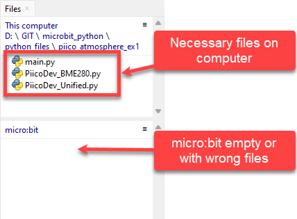
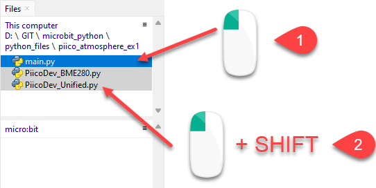
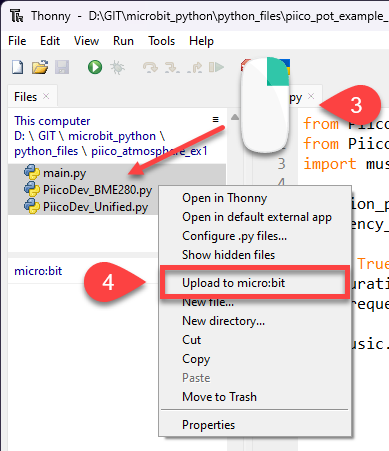
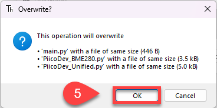

# Using PiicoDev

PiicoDev is a range of plug-and-play sensors and output modules made by the Australian company [Core Electronics](https://core-electronics.com.au/). Every PiicoDev module uses the same cable, so you can connect modules to the micro:bit without soldering or breadboards.

## Connect a module

1. Plug the micro:bit into the **PiicoDev Adapter for micro:bit**, with the buttons and LED display facing up.
2. Connect the module to the adapter with a PiicoDev cable.
3. To use more than one module, connect them in a chain: adapter → module → module.
4. Connect the micro:bit to your computer with the USB cable.

!!! note "Address switches (ASW)"
    Some modules have small **ASW** switches. These let you connect two of the same module at once. Unless a page tells you otherwise, keep all ASW switches **off**.

## Files a PiicoDev program needs

The code for the micro:bit's own components is already on the micro:bit. The code for PiicoDev modules is not, so every PiicoDev program folder needs extra files next to `main.py`:

- `PiicoDev_Unified.py` → handles communication with all PiicoDev modules. You need one copy in each program folder.
- **a device driver** → the commands for one type of module. You need one driver for each **type** of module you use.

For example, a program that uses the Distance Sensor and the OLED Module needs `main.py`, `PiicoDev_Unified.py`, `PiicoDev_VL53L1X.py` and `PiicoDev_SSD1306.py`.

The example and exercise folders in your tutorial files already contain the files they need.

### Device drivers

| Module | Driver file | Extra files |
| --- | --- | --- |
| Atmospheric Sensor | `PiicoDev_BME280.py` | |
| Colour Sensor | `PiicoDev_VEML6040.py` | |
| Distance Sensor | `PiicoDev_VL53L1X.py` | |
| Potentiometer (rotary and slide) | `PiicoDev_Potentiometer.py` | |
| Button | `PiicoDev_Switch.py` | |
| Real Time Clock | `PiicoDev_RV3028.py` | |
| 3x RGB LED | `PiicoDev_RGB.py` | |
| OLED Module | `PiicoDev_SSD1306.py` | `font-pet-me-128.dat` for text |
| Servo Driver | `PiicoDev_Servo.py` | |

## Upload the files

A PiicoDev program only works when **all** its files are on the micro:bit. Upload them together:

1. **Stop** any running program.
2. In the **This computer** part of the Files panel, open the program folder.

    

3. Click the first file, hold ++shift++ and click the last file to select them all.

    

4. Right-click the selected files and choose **Upload to micro:bit**.

    

5. If Thonny asks whether to overwrite files with the same names, click **OK**.

    

6. Open `main.py` and **run** it.

!!! tip
    Driver files stay on the micro:bit after they are uploaded. You only need to upload them again when you use a module that needs a different driver. While you are testing, you can run `main.py` straight from Thonny without uploading it each time.
