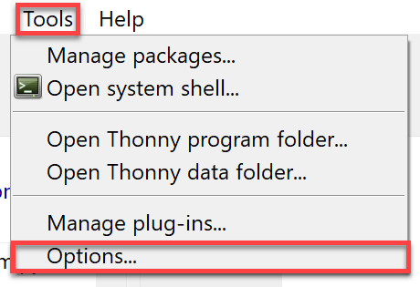
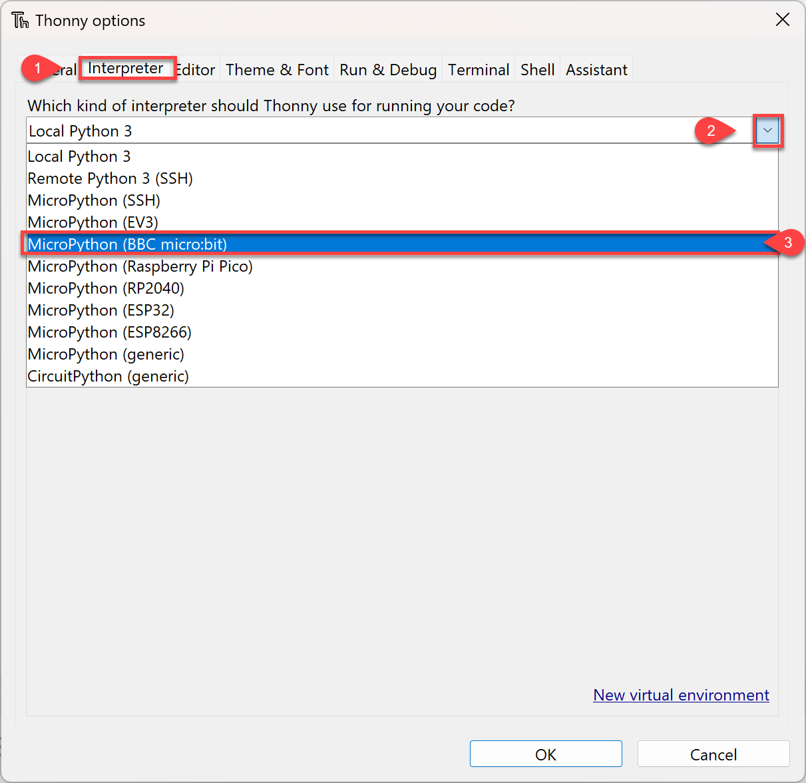
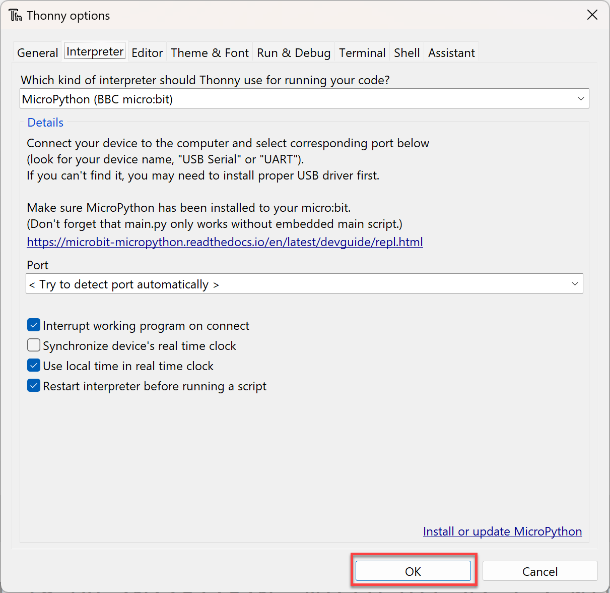
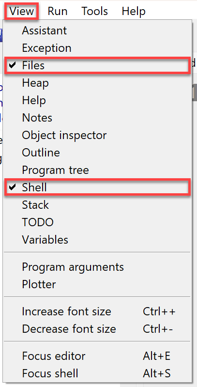
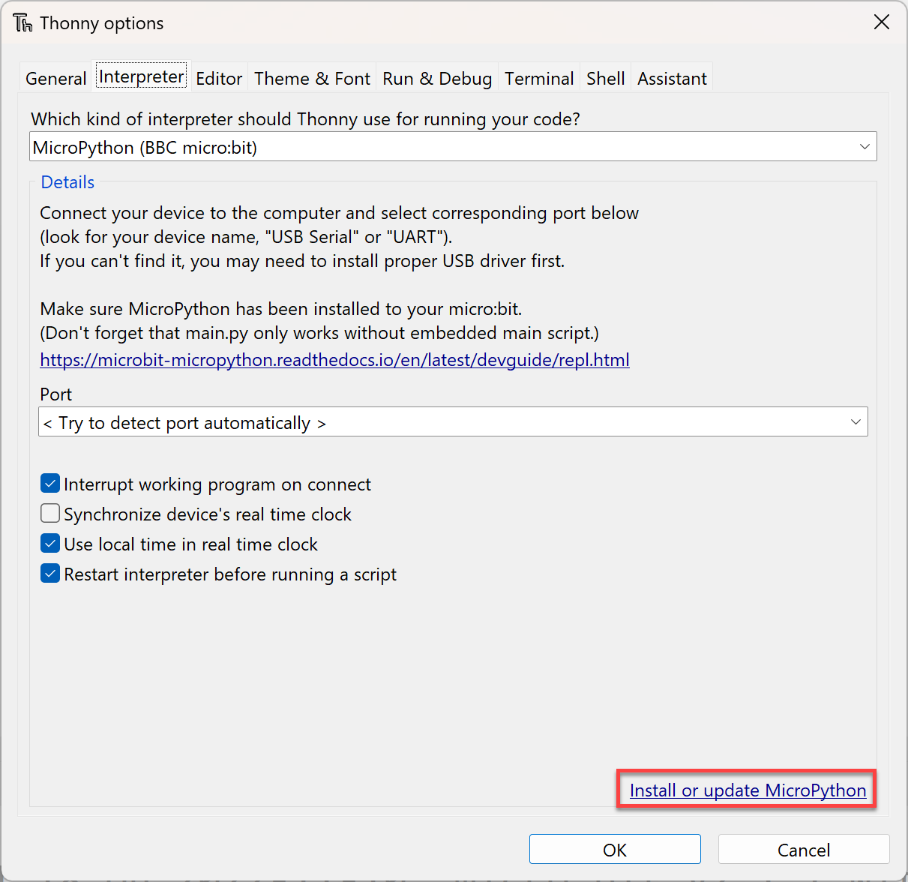
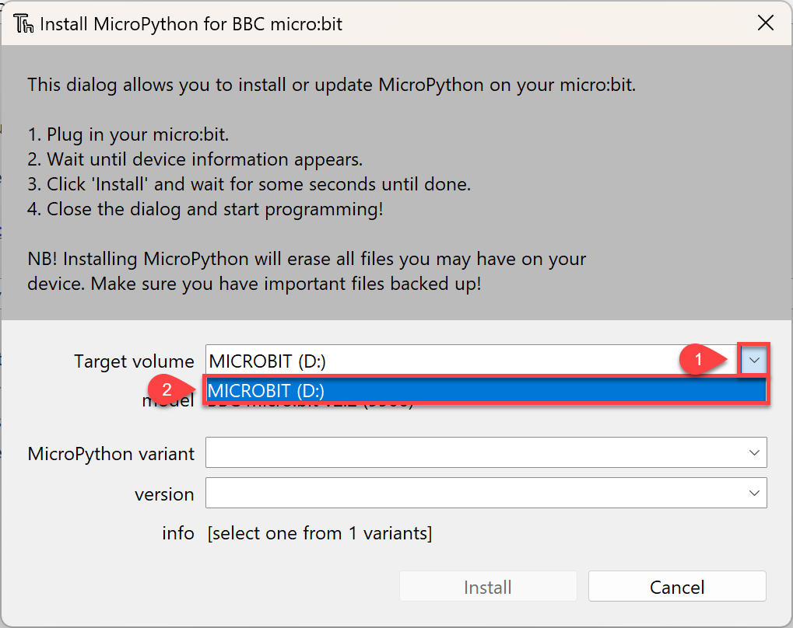
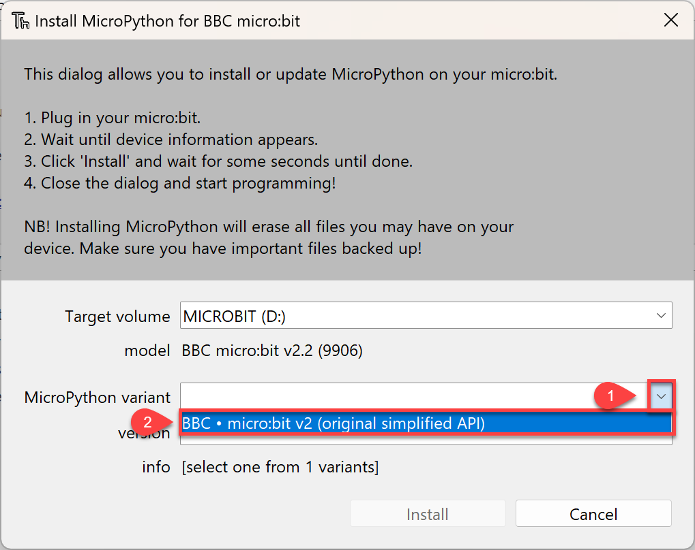
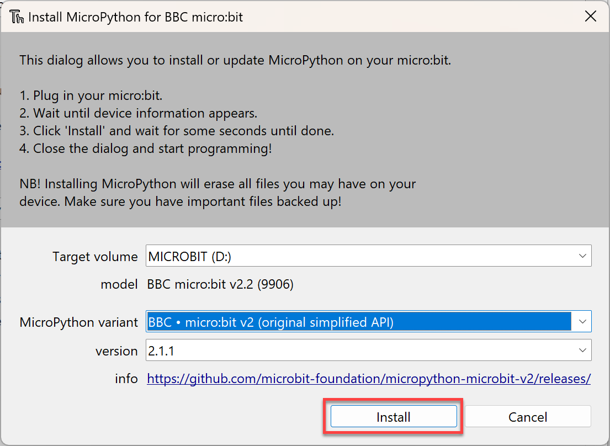
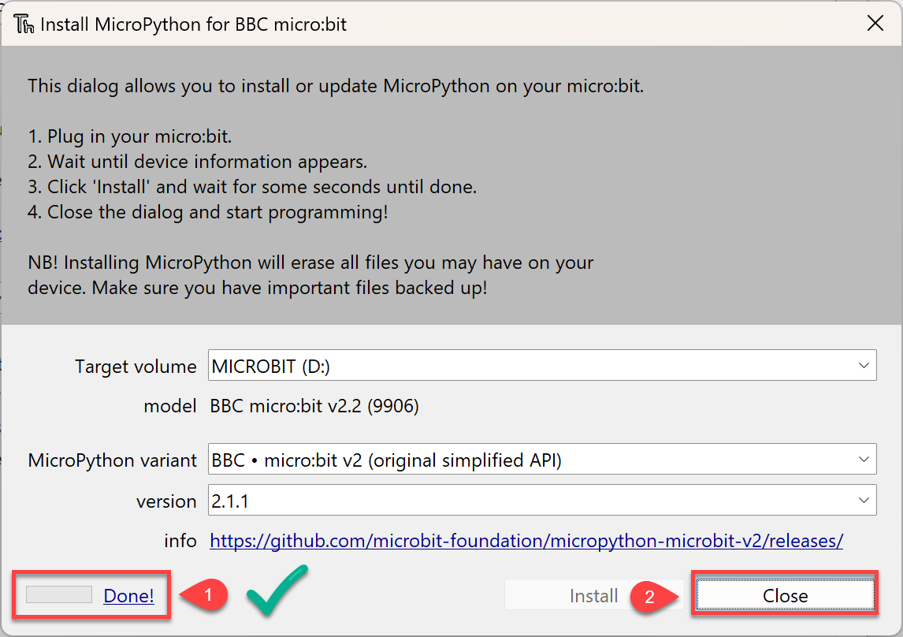
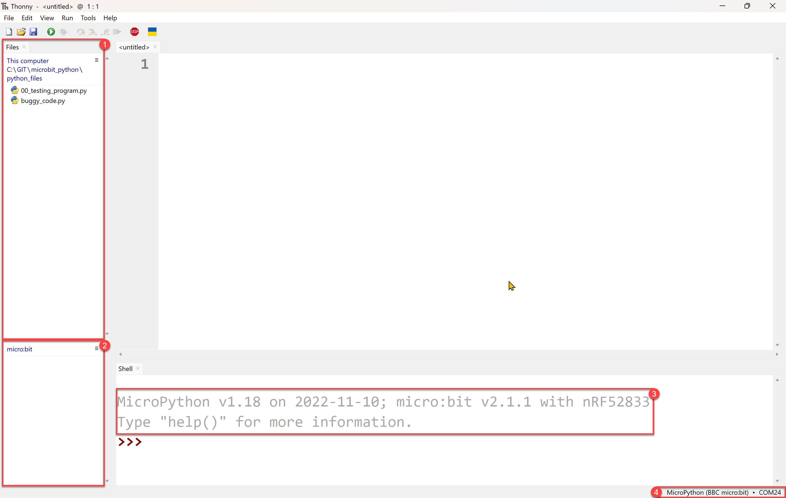

# Setting up Thonny

!!! learn "On this page we will learn"
    - what MicroPython, the micro:bit and Thonny are
    - how to connect the micro:bit and set up Thonny
    - what each part of the Thonny window does
    - how to get the tutorial files

!!! terms "Terminology"
    - **MicroPython** – a version of the Python programming language designed to run on microcontrollers.
    - **microcontroller** – a tiny computer chip used to control devices such as robots, sensors and household appliances.
    - **embedded programming** – writing programs that run on microcontrollers built into devices.
    - **micro:bit** – a small, pocket-sized educational computer with buttons, a display and sensors that we can program.
    - **IDE** – an Integrated Development Environment, which is an app for writing, running and fixing code.
    - **interpreter** – the program that reads our code and runs it, such as MicroPython on the micro:bit or Python 3 on the computer.

During this course we will use **Thonny** to write **MicroPython** programs for the **micro:bit**. This page shows how to set everything up.

## What is MicroPython?

MicroPython is a version of Python designed to run on **microcontrollers**. Microcontrollers are tiny computer chips used in devices such as robots, sensors and household appliances. Writing programs for microcontrollers is called **embedded programming**.

## What is a micro:bit?

We will use an educational microcontroller called a micro:bit. It is a small, pocket-sized computer designed for learning coding and electronics. It has buttons, a display and sensors that can be programmed to do different tasks.

## What is Thonny?

For this course we will use Thonny, an **IDE** (Integrated Development Environment). An IDE is an app for writing and running code. It has built-in support for MicroPython and the micro:bit. If you don't have Thonny, download it from [thonny.org](https://thonny.org/) and install it.

## Setup

### 1. Connect the micro:bit

Connect the micro:bit to your computer with the USB cable.

### 2. Change the interpreter

By default, Thonny runs programs with its own copy of Python 3. We need it to use MicroPython on the micro:bit instead.

Choose **Tools** → **Options**.

Click **Interpreter**, choose **MicroPython (BBC micro:bit)** from the dropdown.

Click **OK**.

### 3. Show the Files panel

To work with files on the micro:bit, we need to show the **Files** panel in Thonny.

Click **View** and make sure **Files** is ticked.

### 4. Install MicroPython (only if needed)

Only do this if your teacher asks you to, or if the micro:bit is not working properly with Thonny.

Go back to **Tools** → **Options** → **Interpreter** and click **Install or update MicroPython**.

Open the **Target volume** dropdown and select **MICROBIT**. Your drive letter may be different.

Open the **MicroPython variant** dropdown and select **BBC micro:bit v2 (original simplified API)**.

Click **Install**.

Wait until the progress shows **Done** (1), then click **Close** (2).

## The Thonny window

Thonny is now set up. Your screen should look similar to the one below.

1. **This computer** → the files on your computer
2. **BBC micro:bit** → the files on the micro:bit
3. **Shell** → shows the MicroPython version and the micro:bit version
4. **Status bar** → shows that you are connected to a micro:bit and the port it uses

## Tutorial files

All the example and exercise files we will use in this course are in this zip file: [microbit_tutorials.zip](../downloads/microbit_tutorials.zip)

1. Download the zip file.
2. Extract it into your Technologies folder.
3. In Thonny's Files panel, navigate to the new **microbit_tutorials** folder.

Inside you will find a folder for each page of this site (for example, `display`). Inside each of those is a folder for each example and exercise, each containing its own `main.py`.
