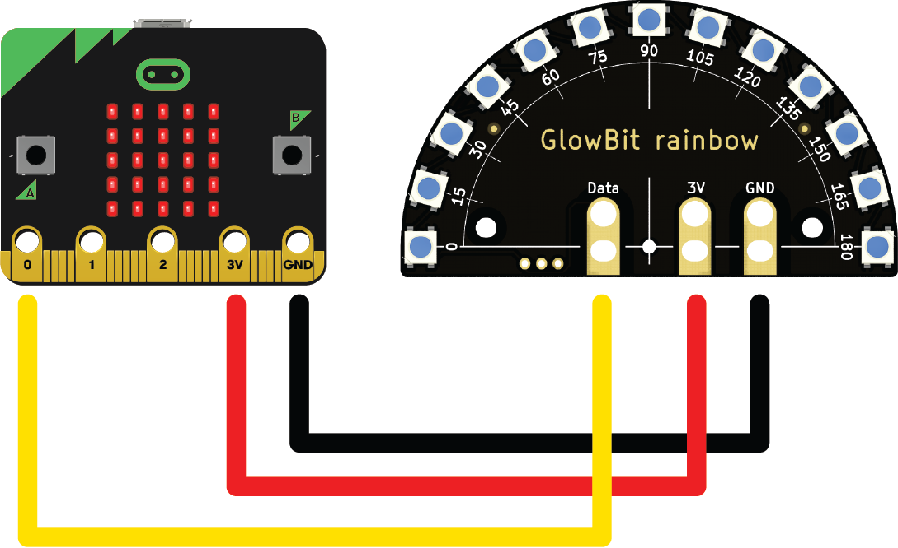

# Glowbit Rainbow

!!! learn "On this page we will learn"
    - how to connect the Glowbit Rainbow
    - how to set one LED's colour
    - how to fill and clear all the LEDs

!!! terms "Terminology"
    - **alligator clip** – a spring-loaded metal clip on a wire used to make quick connections without soldering.
    - **GND** – ground, the connection that completes an electrical circuit back to the negative side of the power.
    - **data pin** – the pin that carries signals from the micro:bit to tell a device what to do.
    - **NeoPixel** – a type of full-colour LED that can be joined in strips and controlled one at a time from a single data pin.

<iframe width="560" height="315" src="https://www.youtube-nocookie.com/embed/VFJ50tXNEbA" title="YouTube video player" frameborder="0" allow="accelerometer; autoplay; clipboard-write; encrypted-media; gyroscope; picture-in-picture; web-share" allowfullscreen></iframe>

The Glowbit Rainbow is an arc of 13 full-colour LEDs, each of which can be set to any colour.

Possible uses:

- level meters for sound or sensor readings
- countdown timers
- decorative light effects
- colour-coded status displays

## Connect it

Unplug the micro:bit's USB cable and battery before wiring. Connect the Glowbit to the micro:bit with alligator clips:

- **black** → micro:bit **GND** to Glowbit **GND**
- **red** → micro:bit **3V** to Glowbit **3V**
- **yellow** → micro:bit **0** to Glowbit **Data**



The Glowbit uses MicroPython's built-in `neopixel` module, so no extra files are needed.

- The LEDs are numbered `0` to `12`.
- Colours are **tuples** of three numbers, `(red, green, blue)`, each from `0` to `255`.
- Changes only appear after `show()`.

## Set it up

```python linenums="1"
from microbit import *
import neopixel

rainbow = neopixel.NeoPixel(pin0, 13)
```

## Methods

| Method | Parameters | Returns | Description |
| --- | --- | --- | --- |
| `neopixel.NeoPixel(pin, n)` | `pin`: the data pin<br>`n`: number of LEDs | NeoPixel | Creates the LED strip |
| `rainbow[n] = colour` | `n`: LED 0–12<br>`colour`: `(r, g, b)` | none | Sets one LED's colour |
| `rainbow.fill(colour)` | `colour`: `(r, g, b)` | none | Sets every LED to one colour |
| `rainbow.show()` | none | none | Sends the colours to the LEDs |
| `rainbow.clear()` | none | none | Turns every LED off straight away |

### Setting one LED

Sets the colour of one LED by its number. The colour appears after `show()`.

```python linenums="1"
--8<-- "examples/other/glowbit/set_pixel/main.py"
```

!!! primm "PRIMM"
    1. **Predict** what you think will happen. Be specific.
    2. **Run** the program.
    3. Time to **investigate** the code. What does each line do?

??? note "Code explanation"
    - **line 1** → imports all the commands from the `microbit` library.
    - **line 2** → imports the `neopixel` module.
    - **line 5** → creates a strip of 13 LEDs on pin 0 and calls it `rainbow`.
    - **line 8** → starts an endless loop.
    - **line 9** → sets the first LED to red.
    - **line 10** → sends the colours to the LEDs.

### `fill()` and `show()`

`fill()` sets every LED to the same colour. `show()` sends the colours to the LEDs.

```python linenums="1"
--8<-- "examples/other/glowbit/fill/main.py"
```

!!! primm "PRIMM"
    1. **Predict** what you think will happen. Be specific.
    2. **Run** the program.
    3. Time to **investigate** the code. What does each line do?

??? note "Code explanation"
    - **line 1** → imports all the commands from the `microbit` library.
    - **line 2** → imports the `neopixel` module.
    - **line 5** → creates a strip of 13 LEDs on pin 0 and calls it `rainbow`.
    - **line 8** → starts an endless loop.
    - **line 9** → sets every LED to a dim green.
    - **line 10** → sends the colours to the LEDs.

### `clear()`

Turns every LED off straight away.

```python linenums="1"
--8<-- "examples/other/glowbit/clear/main.py"
```

!!! primm "PRIMM"
    1. **Predict** what you think will happen. Be specific.
    2. **Run** the program.
    3. Time to **investigate** the code. What does each line do?

??? note "Code explanation"
    - **line 1** → imports all the commands from the `microbit` library.
    - **line 2** → imports the `neopixel` module.
    - **line 5** → creates a strip of 13 LEDs on pin 0 and calls it `rainbow`.
    - **line 8** → starts an endless loop.
    - **line 9** → sets every LED to a dim purple.
    - **line 10** → sends the colours to the LEDs.
    - **line 11** → waits 1 second.
    - **line 12** → turns every LED off.
    - **line 13** → waits 1 second before the loop repeats.

## Documentation

Documentation is the official guide written by the people who made the code library, and we can use it to look up every method and its parameters, including ones that aren't covered on this page.

- [BBC micro:bit MicroPython — NeoPixel](https://microbit-micropython.readthedocs.io/en/v2-docs/neopixel.html)
