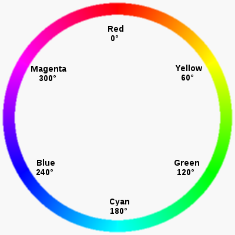

# Colour Sensor

<iframe width="560" height="315" src="https://www.youtube-nocookie.com/embed/d6Ot4NlOBfo" title="YouTube video player" frameborder="0" allow="accelerometer; autoplay; clipboard-write; encrypted-media; gyroscope; picture-in-picture; web-share" allowfullscreen></iframe>

The PiicoDev Colour Sensor (VEML6040) measures the red, green, blue and white light reflected from an object, and can identify its colour.

Possible uses:

- sorting objects by colour
- line-following robots
- colour-matching games
- ambient light measurement

## Connect it

1. Connect the sensor to the PiicoDev adapter with a PiicoDev cable. See [Using PiicoDev](../micropython/piicodev.md).
2. Upload these files to the micro:bit with `main.py`:
    - `PiicoDev_Unified.py`
    - `PiicoDev_VEML6040.py`

!!! tip "Two ways to describe colour"
    **RGB** describes a colour by how much **red**, **green** and **blue** light it contains. Screens mix these three colours to make every other colour.

    **HSV** describes a colour by:

    - **hue** → which colour it is, as an angle on the colour wheel: red `0`, green `120`, blue `240`
    - **saturation** → how intense it is: bright red is high, reddish grey is low
    - **value** → how light or dark it is

    Hue is the easiest way to identify a colour, because one number tells you which colour it is.

    

## Set it up

```python linenums="1"
from microbit import *
from PiicoDev_VEML6040 import PiicoDev_VEML6040

sensor = PiicoDev_VEML6040()
```

## Methods

| Method | Parameters | Returns | Description |
| --- | --- | --- | --- |
| `sensor.readRGB()` | none | dictionary: `red`, `green`, `blue`, `white` (lux), `cct` (K) | Red, green and blue light levels, plus ambient light and colour temperature |
| `sensor.readHSV()` | none | dictionary: `hue` (0–360), `sat`, `val` | Hue, saturation and value |
| `sensor.classifyHue(hues, min_brightness=0)` | `hues`: dictionary of colour names and hue angles (optional) | string | The name of the closest colour |

### `readRGB()`

Returns the amount of red, green and blue light the sensor sees, plus the ambient light and colour temperature.

```python linenums="1"
--8<-- "examples/piicodev/colour/readRGB/main.py"
```

!!! primm "PRIMM"
    1. **Predict** what you think will happen. Be specific.
    2. **Run** the program.
    3. Time to **investigate** the code. What does each line do?

??? note "Code explanation"
    - **line 1** → imports all the commands from the `microbit` library.
    - **line 2** → imports the Colour Sensor driver.
    - **line 5** → creates the sensor and calls it `sensor`.
    - **line 8** → starts an endless loop.
    - **line 9** → reads the RGB values. They are returned as a **dictionary** and stored in `data`.
    - **line 10** → prints the `red`, `green` and `blue` values from the dictionary.
    - **line 11** → waits 500 milliseconds before the loop repeats.

!!! tip "Dictionaries"
    A dictionary stores values with names (called **keys**). `data["red"]` gets the value stored under the key `"red"`.

### `readHSV()`

Returns the colour the sensor sees as hue, saturation and value.

```python linenums="1"
--8<-- "examples/piicodev/colour/readHSV/main.py"
```

!!! primm "PRIMM"
    1. **Predict** what you think will happen. Be specific.
    2. **Run** the program.
    3. Time to **investigate** the code. What does each line do?

??? note "Code explanation"
    - **line 1** → imports all the commands from the `microbit` library.
    - **line 2** → imports the Colour Sensor driver.
    - **line 5** → creates the sensor and calls it `sensor`.
    - **line 8** → starts an endless loop.
    - **line 9** → reads the HSV values as a dictionary and stores them in `data`.
    - **line 10** → prints the `hue`, `sat` and `val` values.
    - **line 11** → waits 500 milliseconds before the loop repeats.

### `classifyHue()`

Returns the name of the colour the sensor sees.

By default, `classifyHue()` chooses from red, yellow, green, cyan, blue and magenta. Pass your own dictionary of names and hue angles to change the choices.

```python linenums="1"
--8<-- "examples/piicodev/colour/classifyHue/main.py"
```

!!! primm "PRIMM"
    1. **Predict** what you think will happen. Be specific.
    2. **Run** the program.
    3. Time to **investigate** the code. What does each line do?

??? note "Code explanation"
    - **line 1** → imports all the commands from the `microbit` library.
    - **line 2** → imports the Colour Sensor driver.
    - **line 5** → creates the sensor and calls it `sensor`.
    - **line 8** → starts an endless loop.
    - **line 9** → finds the closest colour name and stores it in `colour`.
    - **line 10** → prints the colour name.
    - **line 11** → waits 500 milliseconds before the loop repeats.

## Documentation

Documentation is the official guide written by the people who made the code library, and we can use it to look up every method and its parameters, including ones that aren't covered on this page.

- [Core Electronics — Colour Sensor micro:bit guide](https://core-electronics.com.au/guides/micro-bit/piicodev-colour-sensor-veml6040-micro-bit-guide/)
- [PiicoDev VEML6040 driver](https://github.com/CoreElectronics/CE-PiicoDev-VEML6040-MicroPython-Module)

## Exercises

!!! primm "PRIMM"
    Time to **modify** the code and see what happens.

Starter files are in the `colour` folder of your tutorial files. Solutions are on the [Exercise Solutions](../reference/solutions.md#colour-sensor) page.

### Exercise 1

Starter: `colour/ex1_rgb_dictionary`

Can you print the whole dictionary returned by `readRGB()` every second? What do `white` and `cct` show?

### Exercise 2

Starter: `colour/ex2_show_colour`

Can you show the first letter of the colour the sensor is looking at on the micro:bit display? For example, `R` for red.
