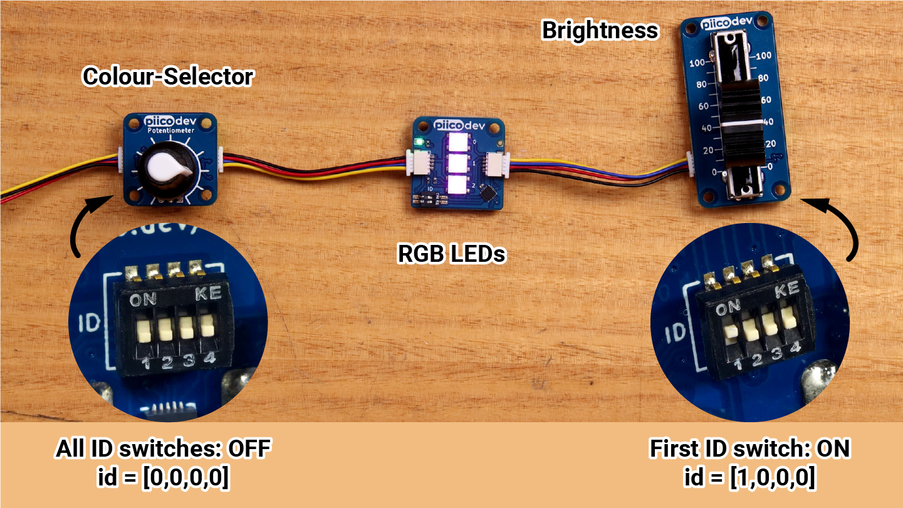

# Potentiometers

<iframe width="560" height="315" src="https://www.youtube-nocookie.com/embed/eD8h_VAoV90" title="YouTube video player" frameborder="0" allow="accelerometer; autoplay; clipboard-write; encrypted-media; gyroscope; picture-in-picture; web-share" allowfullscreen></iframe>

The PiicoDev Rotary and Slide Potentiometers ("pots") give a value that changes smoothly as you turn the knob or move the slider.

Possible uses:

- volume and brightness controls
- game controllers
- dials for setting a value, such as a timer
- menu scrolling

## Connect it

1. Connect the potentiometer to the PiicoDev adapter with a PiicoDev cable. See [Using PiicoDev](../micropython/piicodev.md).
2. Upload these files to the micro:bit with `main.py`:
    - `PiicoDev_Unified.py`
    - `PiicoDev_Potentiometer.py`
3. The rotary and slide potentiometers use the same code.
4. To use more than one pot, give each one a different setting on the **ID switches** on its back. The image shows ID `1, 0, 0, 0`.



## Set it up

```python linenums="1"
from microbit import *
from PiicoDev_Potentiometer import PiicoDev_Potentiometer

pot = PiicoDev_Potentiometer()
```

## Methods

| Method | Parameters | Returns | Description |
| --- | --- | --- | --- |
| `pot.value` | none | float | Position of the knob or slider, from `minimum` to `maximum` (default `0` to `100`) |
| `pot.minimum` | set to a number | float | The value at one end of the travel (default `0`) |
| `pot.maximum` | set to a number | float | The value at the other end of the travel (default `100`) |
| `pot.raw` | none | int (0–1023) | The unscaled reading |
| `PiicoDev_Potentiometer(id=[0, 0, 0, 0])` | `id`: ID switch positions | pot | Creates a pot with a particular ID switch setting |

`value`, `minimum`, `maximum` and `raw` are **properties**, so they have no brackets.

### `value`

Gives the position of the knob or slider, from `minimum` to `maximum` (`0` to `100` unless you change them).

```python linenums="1"
--8<-- "examples/piicodev/potentiometer/value/main.py"
```

!!! primm "PRIMM"
    1. **Predict** what you think will happen. Be specific.
    2. **Run** the program.
    3. Time to **investigate** the code. What does each line do?

??? note "Code explanation"
    - **line 1** → imports all the commands from the `microbit` library.
    - **line 2** → imports the Potentiometer driver.
    - **line 5** → creates the pot and calls it `pot`.
    - **line 8** → starts an endless loop.
    - **line 9** → prints the pot's value (`0` to `100`) in the Shell.
    - **line 10** → waits 100 milliseconds before the loop repeats.

### `minimum` and `maximum`

Set the values `value` gives at each end of the knob's or slider's travel.

Change the range of `value` to suit your project, for example `0` to `9` to match the micro:bit display's brightness levels.

```python linenums="1"
--8<-- "examples/piicodev/potentiometer/min_max/main.py"
```

!!! primm "PRIMM"
    1. **Predict** what you think will happen. Be specific.
    2. **Run** the program.
    3. Time to **investigate** the code. What does each line do?

??? note "Code explanation"
    - **line 1** → imports all the commands from the `microbit` library.
    - **line 2** → imports the Potentiometer driver.
    - **line 5** → creates the pot and calls it `pot`.
    - **line 6** → sets the lowest value to `0`.
    - **line 7** → sets the highest value to `9`.
    - **line 10** → starts an endless loop.
    - **line 11** → prints the pot's value, now from `0` to `9`, in the Shell.
    - **line 12** → waits 100 milliseconds before the loop repeats.

### `raw`

Gives the unscaled reading from the pot, from `0` to `1023`. It ignores `minimum` and `maximum`.

```python linenums="1"
--8<-- "examples/piicodev/potentiometer/raw/main.py"
```

!!! primm "PRIMM"
    1. **Predict** what you think will happen. Be specific.
    2. **Run** the program.
    3. Time to **investigate** the code. What does each line do?

??? note "Code explanation"
    - **line 1** → imports all the commands from the `microbit` library.
    - **line 2** → imports the Potentiometer driver.
    - **line 5** → creates the pot and calls it `pot`.
    - **line 8** → starts an endless loop.
    - **line 9** → prints the unscaled reading in the Shell.
    - **line 10** → waits 100 milliseconds before the loop repeats.

### Using more than one pot

Each pot is created with the ID matching its switches, so your program can tell them apart.

Connect a rotary pot with ID `0, 0, 0, 0` and a slide pot with ID `1, 0, 0, 0`.

```python linenums="1"
--8<-- "examples/piicodev/potentiometer/multiple/main.py"
```

!!! primm "PRIMM"
    1. **Predict** what you think will happen. Be specific.
    2. **Run** the program.
    3. Time to **investigate** the code. What does each line do?

??? note "Code explanation"
    - **line 1** → imports all the commands from the `microbit` library.
    - **line 2** → imports the Potentiometer driver.
    - **line 5** → creates the pot with ID `0, 0, 0, 0` and calls it `knob`.
    - **line 6** → creates the pot with ID `1, 0, 0, 0` and calls it `slider`.
    - **line 9** → starts an endless loop.
    - **line 10** → prints both values in the Shell.
    - **line 11** → waits 100 milliseconds before the loop repeats.

## Documentation

- [Core Electronics — Potentiometer guide](https://core-electronics.com.au/guides/piicodev-potentiometer-getting-started-guide/)
- [PiicoDev Potentiometer driver](https://github.com/CoreElectronics/CE-PiicoDev-Potentiometer-MicroPython-Module)
