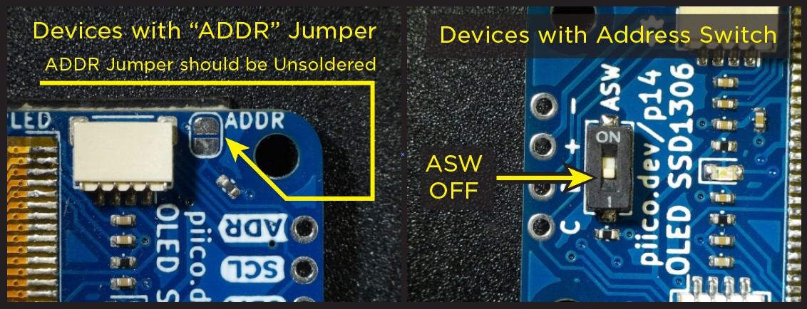

# OLED Display

<iframe width="560" height="315" src="https://www.youtube-nocookie.com/embed/xEcLUxhMMDY" title="YouTube video player" frameborder="0" allow="accelerometer; autoplay; clipboard-write; encrypted-media; gyroscope; picture-in-picture; web-share" allowfullscreen></iframe>

The PiicoDev OLED Display is a 128 × 64 pixel white-on-black screen that can show text, shapes, graphs and images.

Possible uses:

- showing sensor readings and units
- menus and scoreboards
- live graphs
- simple animations and games

## Connect it

1. Make sure the **ASW** switch on the back is **off**.

    

2. Connect the display to the PiicoDev adapter with a PiicoDev cable. See [Using PiicoDev](../micropython/piicodev.md).
3. Upload these files to the micro:bit with `main.py`:
    - `PiicoDev_Unified.py`
    - `PiicoDev_SSD1306.py`
    - `font-pet-me-128.dat` → needed for `text()`
    - `piicodev-logo.pbm` → only needed for the `load_pbm()` example
4. Pixels are located by `(x, y)` coordinates. `(0, 0)` is the top left and `(127, 63)` is the bottom right.
5. Colour `1` is white (on) and `0` is black (off).
6. Drawing happens in memory. Nothing appears on the screen until `show()`, which is why every example calls it.

!!! warning "Name the display `oled`"
    The micro:bit already uses the name `display` for its LED display, so call the OLED `oled`.

## Set it up

```python linenums="1"
from microbit import *
from PiicoDev_SSD1306 import *

oled = create_PiicoDev_SSD1306()
```

## Methods

| Method | Parameters | Returns | Description |
| --- | --- | --- | --- |
| `oled.show()` | none | none | Sends everything drawn to the screen |
| `oled.fill(c)` | `c`: 0 or 1 | none | Fills the whole screen. `fill(0)` clears it. |
| `oled.pixel(x, y, c)` | `x`: 0–127, `y`: 0–63, `c`: 0 or 1 | none | Draws one pixel |
| `oled.hline(x, y, l, c)` | start `x`, `y`; length `l` | none | Draws a horizontal line to the right |
| `oled.vline(x, y, l, c)` | start `x`, `y`; length `l` | none | Draws a vertical line downwards |
| `oled.line(x1, y1, x2, y2, c)` | two end points | none | Draws a line between two points |
| `oled.rect(x, y, w, h, c)` | top-left `x`, `y`; width `w`; height `h` | none | Draws a rectangle outline |
| `oled.fill_rect(x, y, w, h, c)` | top-left `x`, `y`; width `w`; height `h` | none | Draws a filled rectangle |
| `oled.circ(x, y, r, t, c)` | centre `x`, `y`; radius `r`; thickness `t` (0–1) | none | Draws a circle. `t=1` is filled. |
| `oled.arc(x, y, r, start, end, t, c)` | centre, radius, start and end angles (0–360), thickness | none | Draws part of a circle |
| `oled.text(s, x, y, c=1)` | string `s` (up to 16 characters); top-left `x`, `y` | none | Writes text. Each character is 8 × 8 pixels. |
| `oled.load_pbm(filename, c)` | `.pbm` image file name | none | Draws a 128 × 64 image |
| `oled.graph2D(minValue, maxValue)` | lowest and highest values to plot | graph | Creates a scrolling graph |
| `oled.updateGraph2D(graph, value)` | the graph; the new value | none | Adds a value to a graph |
| `oled.invert(i)` | `i`: 0 or 1 | none | Swaps black and white |
| `oled.setContrast(c)` | `c`: 0–255 | none | Sets the screen brightness |
| `oled.rotate(r)` | `r`: 0 or 1 | none | Flips the screen upside down |
| `oled.poweroff()` / `oled.poweron()` | none | none | Turns the screen off or back on |

### `fill()`

Fills the whole screen with one colour: `1` for white, `0` for black. `fill(0)` clears the screen.

```python linenums="1"
--8<-- "examples/piicodev/oled/fill/main.py"
```

!!! primm "PRIMM"
    1. **Predict** what you think will happen. Be specific.
    2. **Run** the program.
    3. Time to **investigate** the code. What does each line do?

??? note "Code explanation"
    - **line 1** → imports all the commands from the `microbit` library.
    - **line 2** → imports all the commands from the OLED driver.
    - **line 5** → creates the display and calls it `oled`.
    - **line 8** → starts an endless loop.
    - **line 9** → fills the screen with white, in memory.
    - **line 10** → sends it to the screen.

### `pixel()`

Draws a single pixel at `(x, y)`.

```python linenums="1"
--8<-- "examples/piicodev/oled/pixel/main.py"
```

!!! primm "PRIMM"
    1. **Predict** what you think will happen. Be specific.
    2. **Run** the program.
    3. Time to **investigate** the code. What does each line do?

??? note "Code explanation"
    - **line 1** → imports all the commands from the `microbit` library.
    - **line 2** → imports all the commands from the OLED driver.
    - **line 5** → creates the display and calls it `oled`.
    - **line 8** → starts an endless loop.
    - **line 9** → draws a white pixel in the middle of the screen.
    - **line 10** → sends it to the screen.

### `hline()`

Draws a horizontal line from a starting point, going right.

```python linenums="1"
--8<-- "examples/piicodev/oled/hline/main.py"
```

!!! primm "PRIMM"
    1. **Predict** what you think will happen. Be specific.
    2. **Run** the program.
    3. Time to **investigate** the code. What does each line do?

??? note "Code explanation"
    - **line 1** → imports all the commands from the `microbit` library.
    - **line 2** → imports all the commands from the OLED driver.
    - **line 5** → creates the display and calls it `oled`.
    - **line 8** → starts an endless loop.
    - **line 9** → draws an 80-pixel horizontal line starting at `(10, 10)`.
    - **line 10** → sends it to the screen.

### `vline()`

Draws a vertical line from a starting point, going down.

```python linenums="1"
--8<-- "examples/piicodev/oled/vline/main.py"
```

!!! primm "PRIMM"
    1. **Predict** what you think will happen. Be specific.
    2. **Run** the program.
    3. Time to **investigate** the code. What does each line do?

??? note "Code explanation"
    - **line 1** → imports all the commands from the `microbit` library.
    - **line 2** → imports all the commands from the OLED driver.
    - **line 5** → creates the display and calls it `oled`.
    - **line 8** → starts an endless loop.
    - **line 9** → draws a 40-pixel vertical line starting at `(10, 10)`.
    - **line 10** → sends it to the screen.

### `line()`

Draws a straight line between two points.

```python linenums="1"
--8<-- "examples/piicodev/oled/line/main.py"
```

!!! primm "PRIMM"
    1. **Predict** what you think will happen. Be specific.
    2. **Run** the program.
    3. Time to **investigate** the code. What does each line do?

??? note "Code explanation"
    - **line 1** → imports all the commands from the `microbit` library.
    - **line 2** → imports all the commands from the OLED driver.
    - **line 5** → creates the display and calls it `oled`.
    - **line 8** → starts an endless loop.
    - **line 9** → draws a line from the bottom left `(0, 63)` to the top right `(127, 0)`.
    - **line 10** → sends it to the screen.

### `rect()`

Draws the outline of a rectangle from its top-left corner, width and height.

```python linenums="1"
--8<-- "examples/piicodev/oled/rect/main.py"
```

!!! primm "PRIMM"
    1. **Predict** what you think will happen. Be specific.
    2. **Run** the program.
    3. Time to **investigate** the code. What does each line do?

??? note "Code explanation"
    - **line 1** → imports all the commands from the `microbit` library.
    - **line 2** → imports all the commands from the OLED driver.
    - **line 5** → creates the display and calls it `oled`.
    - **line 8** → starts an endless loop.
    - **line 9** → draws the outline of a 40 × 30 rectangle with its top-left corner at `(10, 10)`.
    - **line 10** → sends it to the screen.

### `fill_rect()`

Draws a filled rectangle from its top-left corner, width and height.

```python linenums="1"
--8<-- "examples/piicodev/oled/fill_rect/main.py"
```

!!! primm "PRIMM"
    1. **Predict** what you think will happen. Be specific.
    2. **Run** the program.
    3. Time to **investigate** the code. What does each line do?

??? note "Code explanation"
    - **line 1** → imports all the commands from the `microbit` library.
    - **line 2** → imports all the commands from the OLED driver.
    - **line 5** → creates the display and calls it `oled`.
    - **line 8** → starts an endless loop.
    - **line 9** → draws a filled 40 × 30 rectangle with its top-left corner at `(10, 10)`.
    - **line 10** → sends it to the screen.

### `circ()`

Draws a circle from its centre and radius. Thickness `1` makes a filled circle; smaller values make a ring.

```python linenums="1"
--8<-- "examples/piicodev/oled/circ/main.py"
```

!!! primm "PRIMM"
    1. **Predict** what you think will happen. Be specific.
    2. **Run** the program.
    3. Time to **investigate** the code. What does each line do?

??? note "Code explanation"
    - **line 1** → imports all the commands from the `microbit` library.
    - **line 2** → imports all the commands from the OLED driver.
    - **line 5** → creates the display and calls it `oled`.
    - **line 8** → starts an endless loop.
    - **line 9** → draws a filled circle (thickness `1`) with radius 20 in the middle of the screen.
    - **line 10** → sends it to the screen.

### `arc()`

Draws part of a circle, between a start angle and an end angle.

```python linenums="1"
--8<-- "examples/piicodev/oled/arc/main.py"
```

!!! primm "PRIMM"
    1. **Predict** what you think will happen. Be specific.
    2. **Run** the program.
    3. Time to **investigate** the code. What does each line do?

??? note "Code explanation"
    - **line 1** → imports all the commands from the `microbit` library.
    - **line 2** → imports all the commands from the OLED driver.
    - **line 5** → creates the display and calls it `oled`.
    - **line 8** → starts an endless loop.
    - **line 9** → draws the part of a circle from 0° to 180° around the middle of the screen, with radius 25 and thickness `0.3`.
    - **line 10** → sends it to the screen.

### `text()`

Writes text on the screen, starting at the top-left corner you give. Each character is 8 × 8 pixels.

```python linenums="1"
--8<-- "examples/piicodev/oled/text/main.py"
```

!!! primm "PRIMM"
    1. **Predict** what you think will happen. Be specific.
    2. **Run** the program.
    3. Time to **investigate** the code. What does each line do?

??? note "Code explanation"
    - **line 1** → imports all the commands from the `microbit` library.
    - **line 2** → imports all the commands from the OLED driver.
    - **line 5** → creates the display and calls it `oled`.
    - **line 8** → starts an endless loop.
    - **line 9** → writes `Hello!` at the top left, in memory.
    - **line 10** → sends it to the screen.

### `load_pbm()`

Draws an image from a `.pbm` file.

Images must be 128 × 64 **PBM** files uploaded to the micro:bit. They take a few seconds to draw because the micro:bit has very little memory.

```python linenums="1"
--8<-- "examples/piicodev/oled/load_pbm/main.py"
```

!!! primm "PRIMM"
    1. **Predict** what you think will happen. Be specific.
    2. **Run** the program.
    3. Time to **investigate** the code. What does each line do?

??? note "Code explanation"
    - **line 1** → imports all the commands from the `microbit` library.
    - **line 2** → imports all the commands from the OLED driver.
    - **line 5** → creates the display and calls it `oled`.
    - **line 8** → starts an endless loop.
    - **line 9** → draws the image in `piicodev-logo.pbm` in white.
    - **line 10** → sends it to the screen.

### `graph2D()` and `updateGraph2D()`

`graph2D()` creates a graph, and `updateGraph2D()` adds a new value to it.

The graph starts at the right of the screen and scrolls left each time a new value is added.

```python linenums="1"
--8<-- "examples/piicodev/oled/graph2D/main.py"
```

!!! primm "PRIMM"
    1. **Predict** what you think will happen. Be specific.
    2. **Run** the program.
    3. Time to **investigate** the code. What does each line do?

??? note "Code explanation"
    - **line 1** → imports all the commands from the `microbit` library.
    - **line 2** → imports all the commands from the OLED driver.
    - **line 5** → creates the display and calls it `oled`.
    - **line 6** → creates a graph for values from `0` to `255` and calls it `graph`.
    - **line 9** → starts an endless loop.
    - **line 10** → clears the screen.
    - **line 11** → adds the micro:bit's light level to the graph.
    - **line 12** → shows the graph.

### `invert()`

Swaps black and white on the whole screen: `1` inverts, `0` returns to normal.

```python linenums="1"
--8<-- "examples/piicodev/oled/invert/main.py"
```

!!! primm "PRIMM"
    1. **Predict** what you think will happen. Be specific.
    2. **Run** the program.
    3. Time to **investigate** the code. What does each line do?

??? note "Code explanation"
    - **line 1** → imports all the commands from the `microbit` library.
    - **line 2** → imports all the commands from the OLED driver.
    - **line 5** → creates the display and calls it `oled`.
    - **line 6** → writes `Invert` at the top left.
    - **line 7** → sends it to the screen.
    - **line 10** → starts an endless loop.
    - **line 11** → swaps black and white.

### `setContrast()`

Sets the brightness of the screen, from `0` (dimmest) to `255` (brightest).

```python linenums="1"
--8<-- "examples/piicodev/oled/setContrast/main.py"
```

!!! primm "PRIMM"
    1. **Predict** what you think will happen. Be specific.
    2. **Run** the program.
    3. Time to **investigate** the code. What does each line do?

??? note "Code explanation"
    - **line 1** → imports all the commands from the `microbit` library.
    - **line 2** → imports all the commands from the OLED driver.
    - **line 5** → creates the display and calls it `oled`.
    - **line 6** → fills the screen with white.
    - **line 7** → sends it to the screen.
    - **line 10** → starts an endless loop.
    - **line 11** → sets the screen brightness to `10`, much dimmer than the default `255`.

### `rotate()`

Flips the screen upside down: `0` is upside down, `1` is the normal way up.

```python linenums="1"
--8<-- "examples/piicodev/oled/rotate/main.py"
```

!!! primm "PRIMM"
    1. **Predict** what you think will happen. Be specific.
    2. **Run** the program.
    3. Time to **investigate** the code. What does each line do?

??? note "Code explanation"
    - **line 1** → imports all the commands from the `microbit` library.
    - **line 2** → imports all the commands from the OLED driver.
    - **line 5** → creates the display and calls it `oled`.
    - **line 6** → writes `Rotate` at the top left.
    - **line 9** → starts an endless loop.
    - **line 10** → turns the screen upside down.
    - **line 11** → redraws the text the new way up.

### `poweroff()` and `poweron()`

Turns the screen off and back on. What was on the screen is remembered while it is off.

```python linenums="1"
--8<-- "examples/piicodev/oled/power/main.py"
```

!!! primm "PRIMM"
    1. **Predict** what you think will happen. Be specific.
    2. **Run** the program.
    3. Time to **investigate** the code. What does each line do?

??? note "Code explanation"
    - **line 1** → imports all the commands from the `microbit` library.
    - **line 2** → imports all the commands from the OLED driver.
    - **line 5** → creates the display and calls it `oled`.
    - **line 6** → writes `On and off` at the top left.
    - **line 7** → shows it.
    - **line 10** → starts an endless loop.
    - **line 11** → turns the screen off. The text is remembered.
    - **line 12** → waits 1 second.
    - **line 13** → turns the screen back on.
    - **line 14** → waits 1 second before the loop repeats.

## Documentation

Documentation is the official guide written by the people who made the code library, and we can use it to look up every method and its parameters, including ones that aren't covered on this page.

- [Core Electronics — OLED micro:bit guide](https://core-electronics.com.au/guides/micro-bit/piicodev-oled-ssd1306-microbit-guide/)
- [PiicoDev SSD1306 driver](https://github.com/CoreElectronics/CE-PiicoDev-SSD1306-MicroPython-Module)
