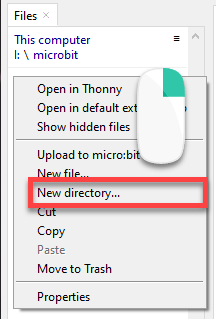
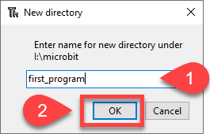
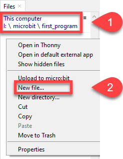
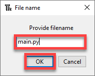
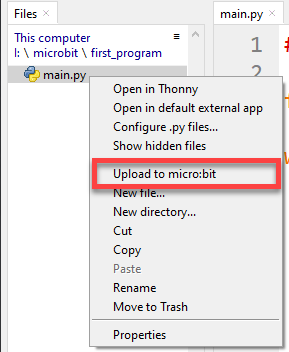
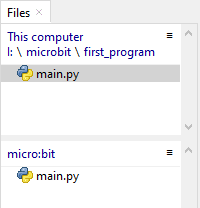

# Your First Program

Before we create our first program, we need to understand how MicroPython works.

## main.py

When a MicroPython microcontroller (like our micro:bit) is turned on, it looks for a file called `main.py` and automatically executes this file. The project can have other files, but there has to be a `main.py`

This means that every project will have a `main.py` file, which can become confusing, not just for us, but for the computer as well. So we need to be better organised with our Python files.

To achieve this, we will create a separate folder for each exercise.

## Creating Folders

Create a new folder on your laptop called **microbit** then navigate to it in the Thonny file panel.


Then right mouse click in the file panel and choose **New directory...**



```{admonition} Directories vs Folders
In computing, directories and folders refer to the same thing, which is a container for files and other directories.

Historically, the term "directory" was used in earlier operating systems such as MS-DOS and UNIX to refer to a hierarchical structure for organizing files. As graphical user interfaces became more common, the term "folder" was introduced to make the concept more intuitive for users.
```

Give the new directory the name **first_program**.



You will now see your **first_program** folder in the files panel. Double click on it to enter that folder.


## Create the New File

Now we will create a new file, but before we do we need to check that we are in the correct folder (1). Then right mouse click and choose **New file...** (2).



Name the file **main.py** and click **OK**



## Add the Code

Now enter the code below into your newly created **main.py** file:

```{literalinclude} ./python_files/first_program/main.py
:linenos:
```

We're going to run our program for the first time, but before let's introduce the PRIMM concept.

```{admonition} PRIMM
Throughout this course we will use the **PRIMM** process to reinforce our learning. **PRIMM** stands for **Predict**, **Run**, **Investigate**, **Modify**, and **Make**. It reflects effective programming practices and encourages curiosity in programming.

**Predict**: Before you run the code you need to predict what you think will happen. Go ahead and have a guess at what you think will happen.

**Run**: Then run the program and see how accurate your prediction was. If your prediction was incorrect, how was the result different?

**Investigate**: Go through the code and work out what each line of code does.

**Modify**: Edit the code. Change it around and see that results your get

**Make**: Use your new understanding of the code to make a different program.
```

Lets run through the **PRIMM** process now

**Predict** in detail what you think the program will do, then **run** the program.


Did you predict that the `"Hello world!"` would scroll across the dot matrix before displaying a heart for two seconds?

Let's **investigate** the code, by breaking it down line-by-line:

- line 1 &rarr; comment identifying the project. This is super important since all our program will be called `main.py`
- line 3 &rarr; imports all the commands from the `micropython` library.
- line 5 &rarr; sets up the endless loop
- line 6 &rarr; scrolls the text across the display
- line 7 &rarr; shows the heart image
- line 8 &rarr; waits 2000 milliseconds before going back to the top of the loop.

Time to **modify** the code and see what happens:

- can yo make it display a different message?
- are there other shapes you can display?
- what happens if you remove the `while` loop?
- what happens if you unplug the micro:bit and plug it back in again?

## Upload the code

So when you unplugged the micro:bit and then plugged it back in, the program didn't restart. While this might not be a surprise, it defeats the purpose of microcontrollers. Microcontrollers are supposed to run by themselves without being connect to a computer.

If you look at Thonny's file panel you will see the problem is that your code is on your laptop not the micro:bit.

To solve this we need to upload the code to the micro:bit. To achieve this:

Right mouse click on `main.py` on your computer and choose **Upload to micro:bit**.



You should now have `main.py` on both your laptop and the micro:bit.



```{admonition} Duplicate files
:class: warning
You now have two copies of `main.py`. These files **do not sync**. If you make changes in one file this will not flow onto the other file.

The best way to ensure files are updated is to develop a working habbit.

I would suggest:

- always edit the laptop copy of the file &rarr; it is your master
- then upload the file to the micro:bit
```

Now try unplugging and plugging your micro:bit back in. The program works. But it is still connected to your computer! That's because it needs your laptop's power.

Let's truly liberate your micro:bit.

Get the battery back out of your kit. Unplug the micro:bit and plug the battery pack in (make sure the battery pack is turned on).

**The micro:bit is free!**