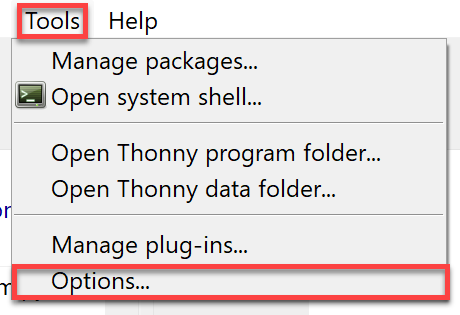
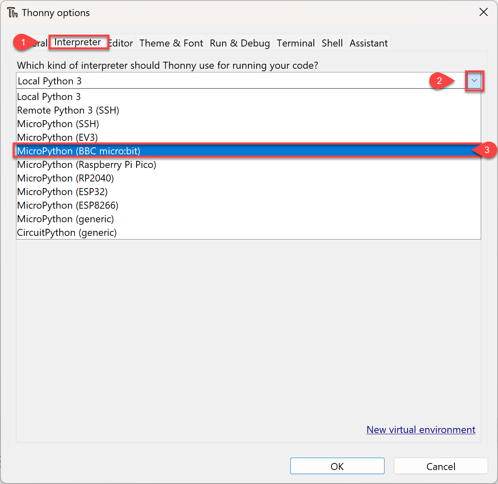
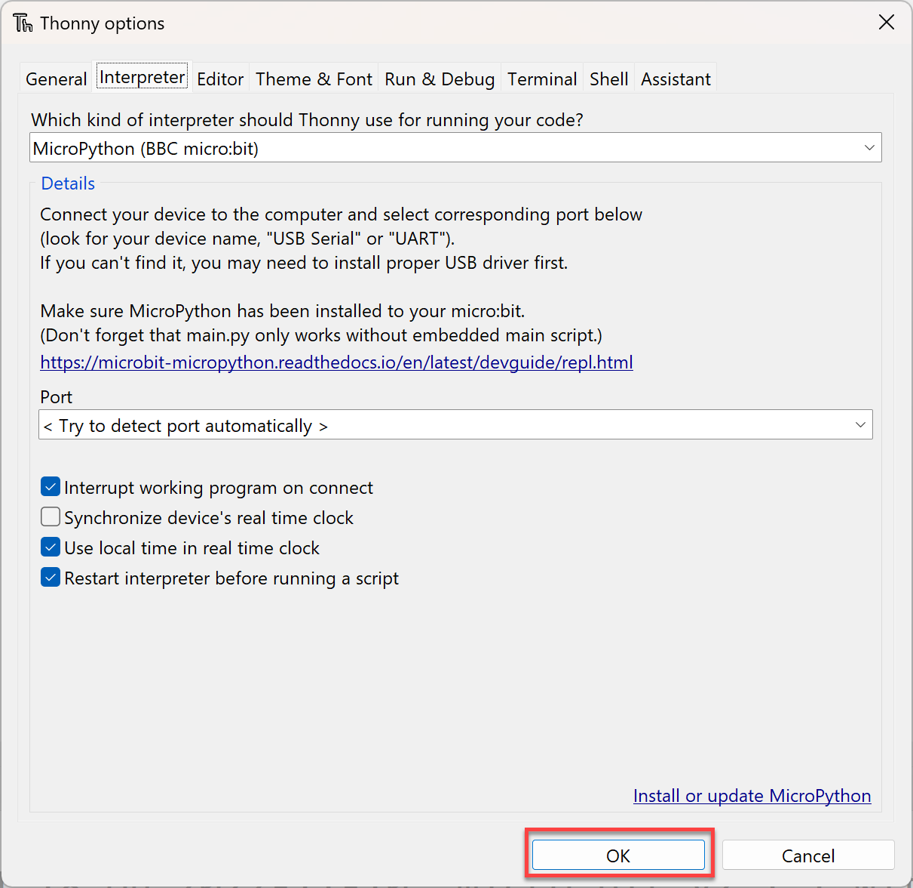
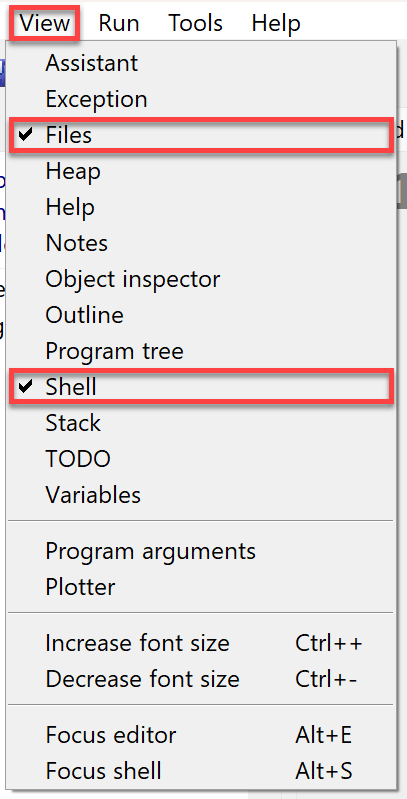
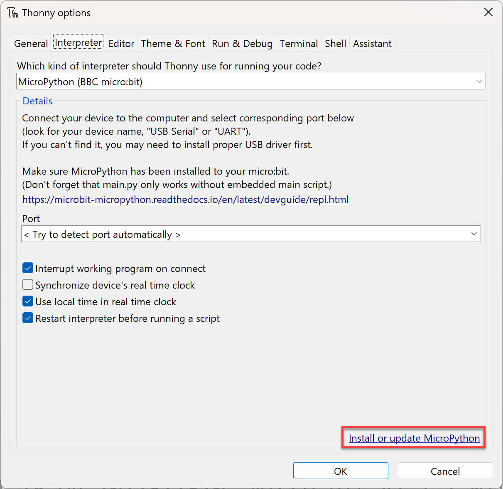
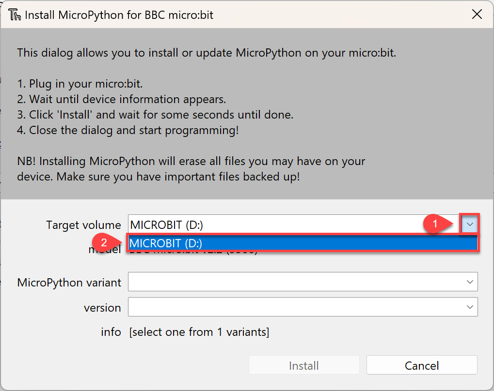
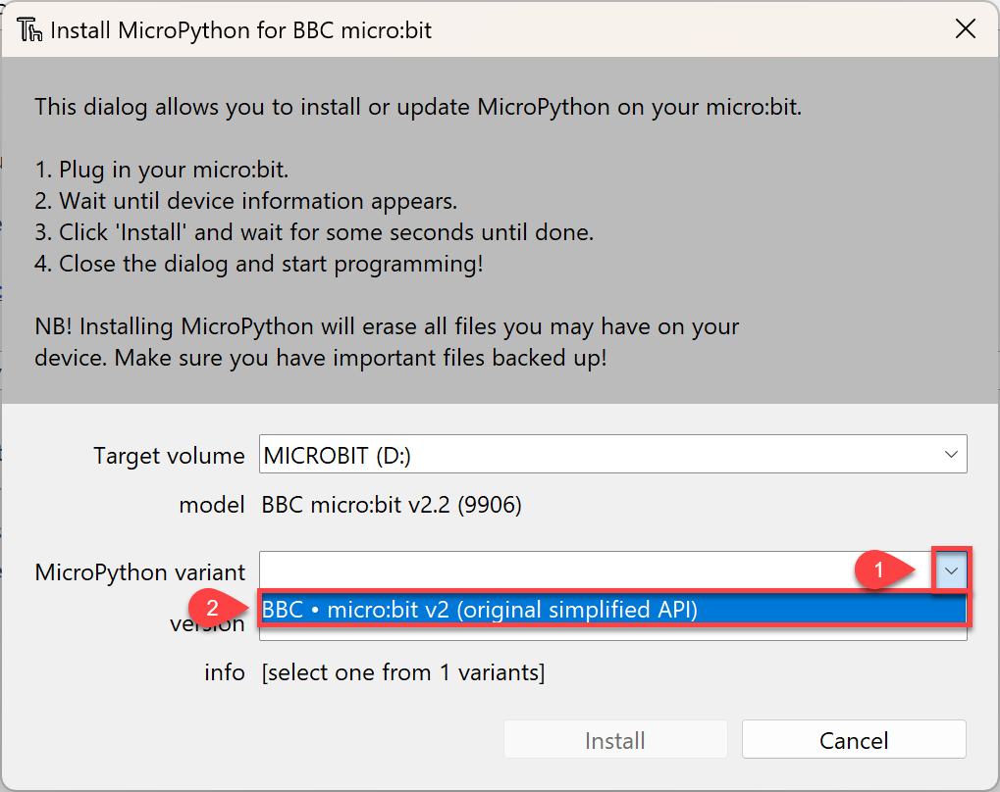
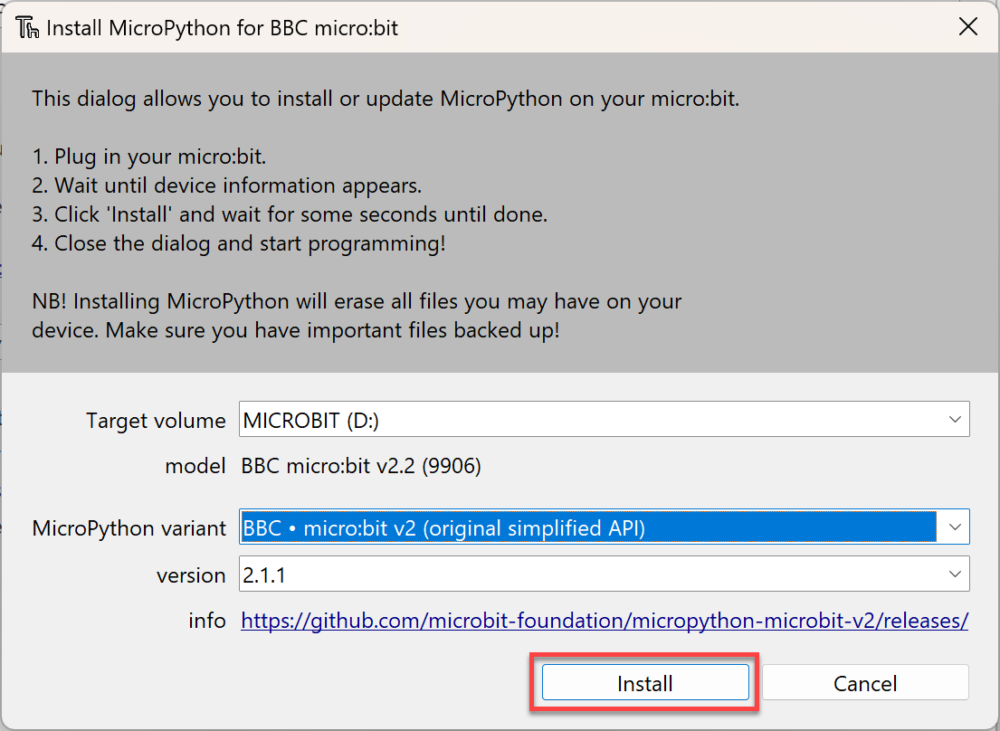
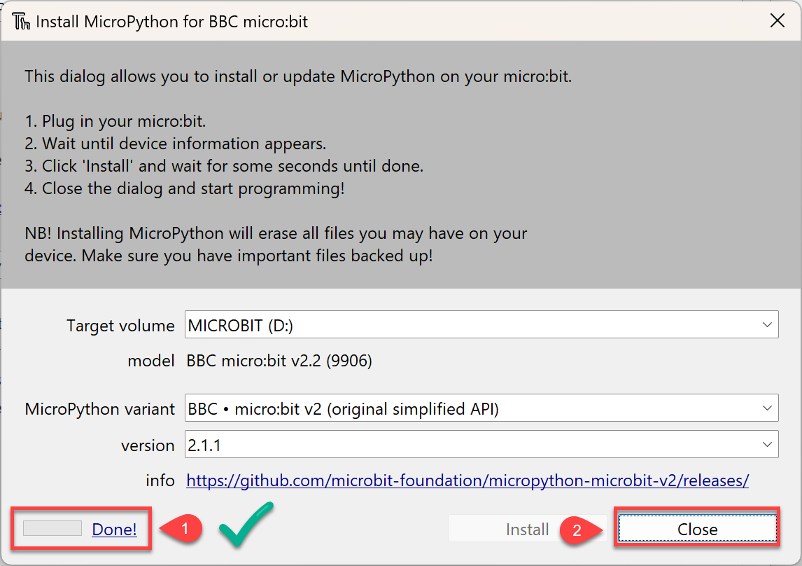
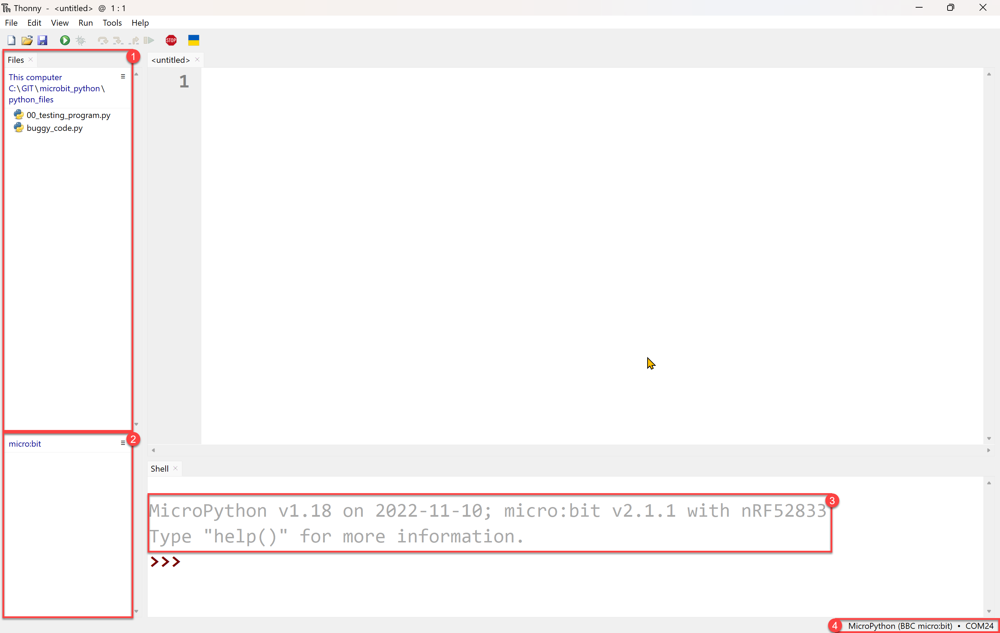

# Getting Started

During this course we will use **Thonny** to write **MicroPython** code to run on **micro:bits**. This section is about getting all three of these elements working together.

## What is MicroPython

MicroPython is a programming language based on Python. It is designed to run on small **microcontrollers**, which are small computer chips that are used in many electronic devices such as robots, sensors, and even some household appliances. Writing programs for microcontrollers is called **embedding programming**.

## What is a micro:bit

We will be using a educational microcontroller called a micro:bit. Micro:bits are small, pocket-sized computers that are designed to help people learn about coding and electronics. They have a variety of features, including buttons, a display, and sensors, that can be programmed to perform different tasks.

## What is Thonny

For this course we will be using the Thonny IDE. Thonny is an educational IDE which has built in supporting for working with MicroPython and micro:bits. If you don't already have Thonny, download it from **[Thonny.org](https://thonny.org/)** and install it.

## Setup

### Prepare Thonny

The first step in our setup is preparing Thonny to use MicroPython on the micro:bit.

#### Connect micro:bit

Connect the micro:bit to your computer using the USB cable.

#### Change the Python Interpreter

By default, Thonny uses its own copy of Python 3 to run your Python scripts. For this course we want it to use MicroPython.

To change the interpreter:

Choose **Tools** &rarr **Options**

Then click on **Interpreter**, then the **dropdown** &rarr; **MicroPython (BBC micro:bit)**

Then click **OK**

#### Change Thonny panels

To work with the micro:bits, we need to access the files panel in Thonny. To do this:

Click **View** and make sure **Files** is selected.

#### Installing MicroPython (optional)

Finally, you may need to update or install MicroPython on the micro:bit. This will be necessary if the micro:bit has a different operating system installed or if its MicroPython is corrupted. 

To do this, again go to the interpreter page like above.

Then click on **Install or update MicroPython**

Click the **Target volume dropdown** then select **MICROBIT** (your drive letter may be different). 

Then select the **MicroPython Variant dropdown** and select **BBC . micro:bit v2 (original simplified API)**

Then click **Install**

Wait until the progress says **Done** (1), then click **Close** (2)

## The IDE

Thonny is now setup. Your UI should look similar to the one below.

Some interesting points to note:

1. This is your computer files panel. It shows the files on your computer.
2. This is the micro:bit file panel. It shows the files that are on the micro:bit.
3. The prompt in the Shell should indicate:
   - your interpreter is MicroPython along with its version
   - your processor is a micro:bit along with its version
4. This shows that you are connected to a micro:bit and the port it is connected to.

